# 实验10  Oracle空间查询

## 1. 使用ArcGIS连接Oracle

在ArcGIS 10.2及以后版本采用了直连的方式连接oracle数据库。采用直连方式比使用SDE方式更加稳定，特别是在大数据量处理的应用中，不易出现由SDE连接进程造成的错误。

首先启动装有Oracle的虚拟机，使用SQL Developer连接上数据库确定其能正常工作。启动ArcGIS或者ArcCatalog，找到Add Database Connection。

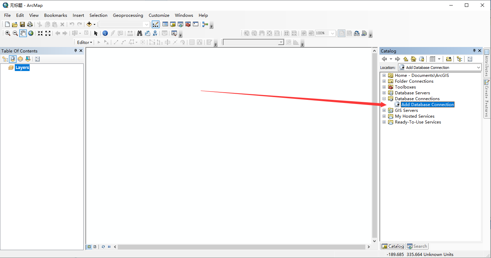

双击启动，根据ip地址设置数据库连接，注意ip地址后面要跟上实例名，这里是xe。填好登录名与密码后点击OK即可。

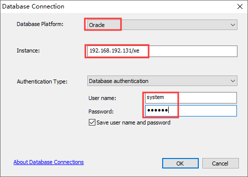

如果一切都配置正确，在Catalog中的数据连接中会生成一个连接。双击或者点击右键连接。如果这里连接错误，返回上一步检查数据库的连接器有没有设置错误。连接成功如下。

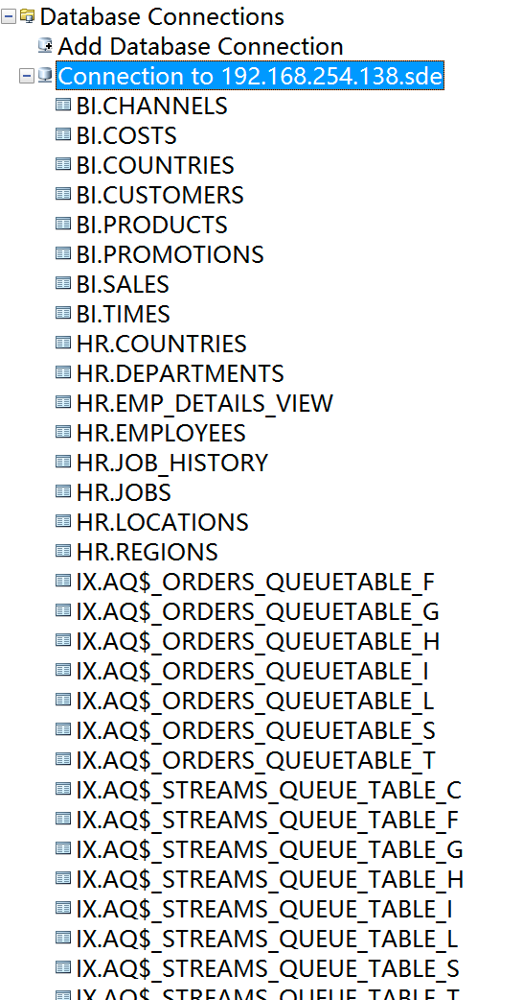

## 2. 使用ArcGIS/ArcCatalog向Oracle中导入数据

首先采用的办法是复制粘贴的办法，使用此操作时，数据格式转换等流程由数据库系统或者SDE后台自动完成。

打开实验操作提供的TEST文件夹，在Catalog内容标签中已将其数据信息列出，点击USA数据库，将其全部选中，点击“复制”。

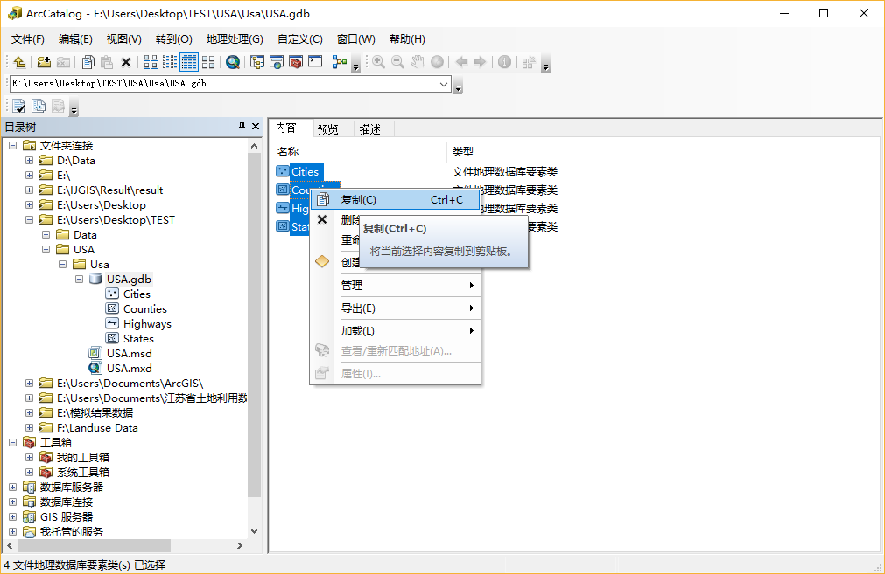

双击SDE数据库，连接数据库。并在其上右键“粘贴”，如下所示：

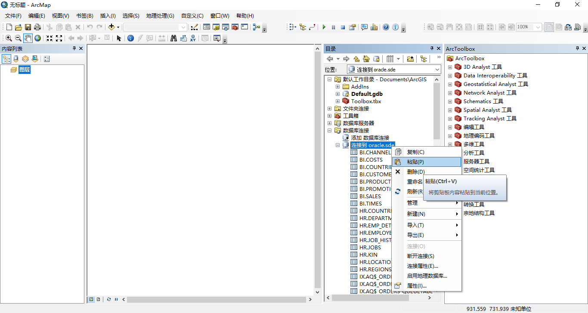

在弹出的数据库传输列表中，可以看到此次需要复制的数据名称，如下所示：

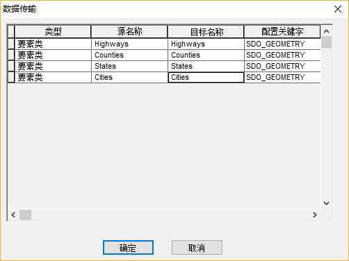

点击“确定”，将矢量图层导入SDE数据表中。此处会出现如下结果：

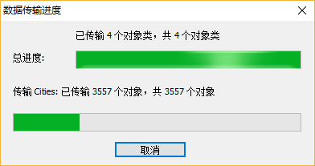

数据传输完成后，得到如下结果，可以看到本次实验所用的空间数据

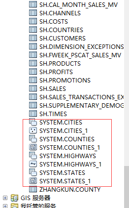

补充：当弹出粘贴失败的对话框时，证明此矢量图层在SDE中存在重名或存在问题。示例如下所示：

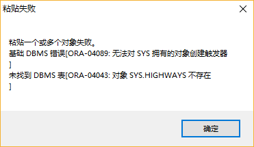

此时，我们根据对话框内容重新设定图层名称或检查数据格式，并依次进行修改，如上图中的图层不能复制粘贴入SDE库的原因在于：对象SYS.HIGHWAYS不存在等问题，查看存在的问题，解决已有的问题，确定即可。

检查数据，打开ArcCatalog的数据库连接，选择目录树栏，选择我们刚才新建的【连接到 oracle.sde】 ，首先查看本地存储的地理空间数据的分布数据，如下所示：

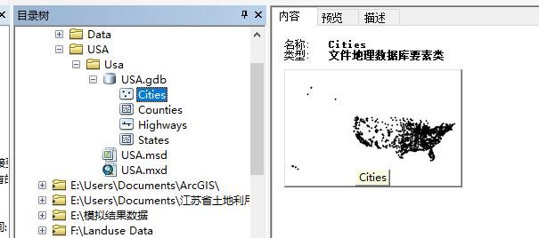
 
然后，再打开连接oracle数据库中存储在Oracle中的地理空间数据的数据存储情况，如下所示，可发现两者的数据表现情况完全一致。

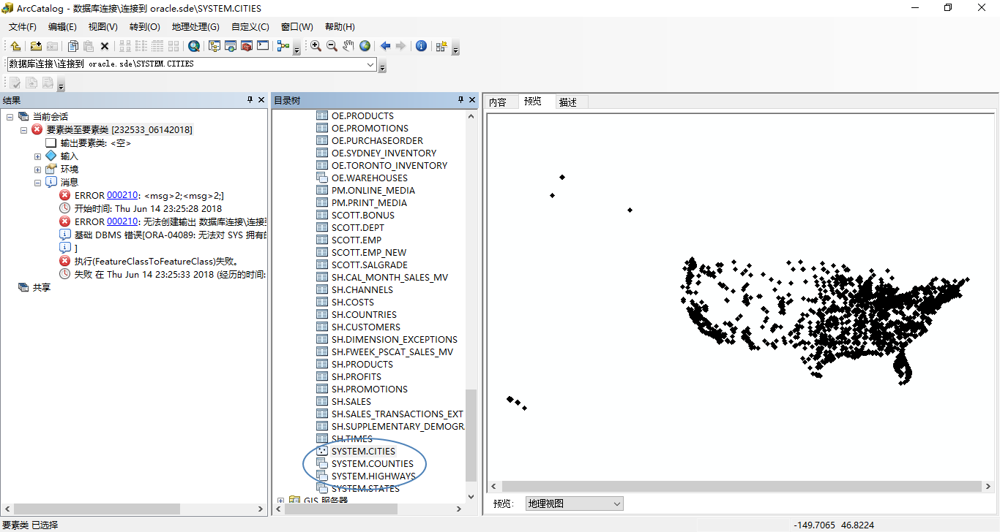

当然在本实验操作过程中，有可能发现某些数据并不能使用复制粘贴的方式加载入SDE数据库中。这时，可以使用导入工具。接下来将介绍导入工具的使用。

右键点击数据库连接，选择import，可以根据需要选择一次导入一个还是一次导入多个数据集。
 
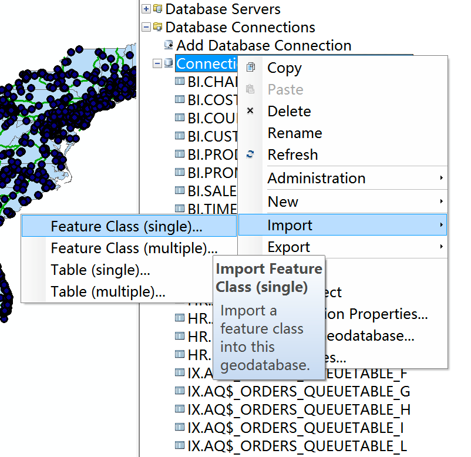

指定导入的表名，点击确定即可完成数据的导入。

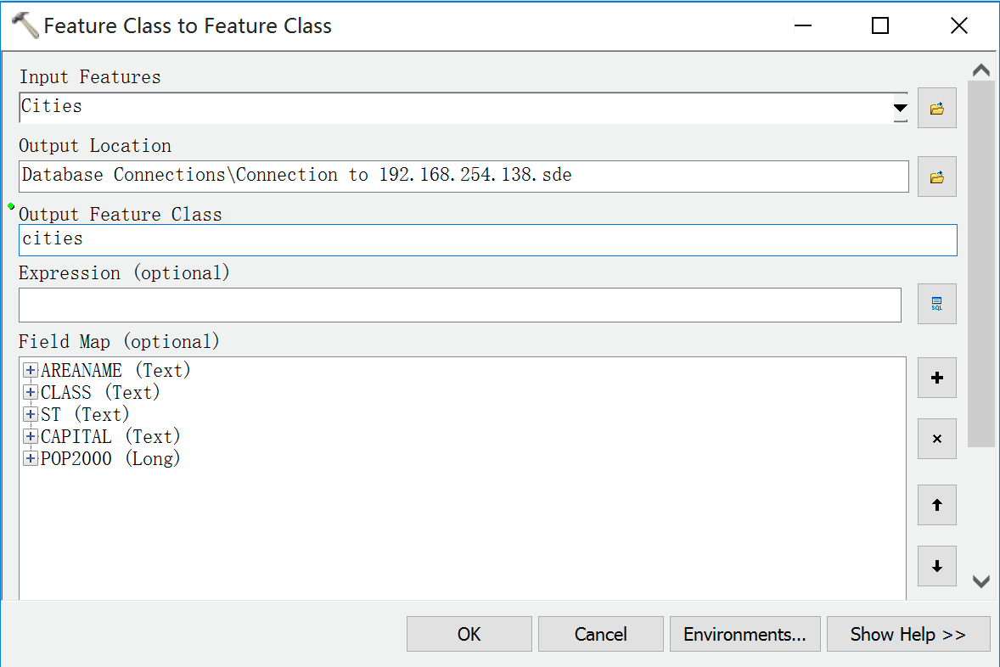

## 3. 数据来源

使用上一步从ArcGIS导入数据库的数据，一共4张表：States、Cities、Highways和Counties。本套实验使用的数据库版本为Oracle 12c，因此不能支持ArcGIS 10.2及以下版本的软件。使用ArcGIS 10.2.1、10.2.2、10.3及以上版本的软件可以正常将shape文件导入到Oracle中。如果上一步骤能完成此步，可以跳过本节剩余内容。

使用system用户登录Oracle，使用SQL Developer打开实验10附带的文件夹中的main.sql。
 
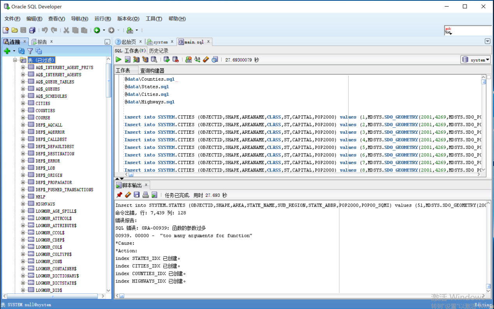

点击运行按钮即可完成数据表的创建以及数据集的导入。使用此方法导入数据可能会因为电脑的配置与系统设置不同出现少许数据不能导入，尚无解决方法，建议条件允许，使用合适版本的ArcGIS导入数据。另外，经测试，Navicat并不能正常地查询空间数据，有极大可能性会直接闪退，尚无解决办法。本实验建议使用ArcGIS 10.3与SQL Developer。

## 4. 属性查询

与空间处理相关的函数以及程序包都在mdsys用户中，可以登录mdsys查看相关函数与文档。如果无法登录，请登录管理页面重置该账户。
 
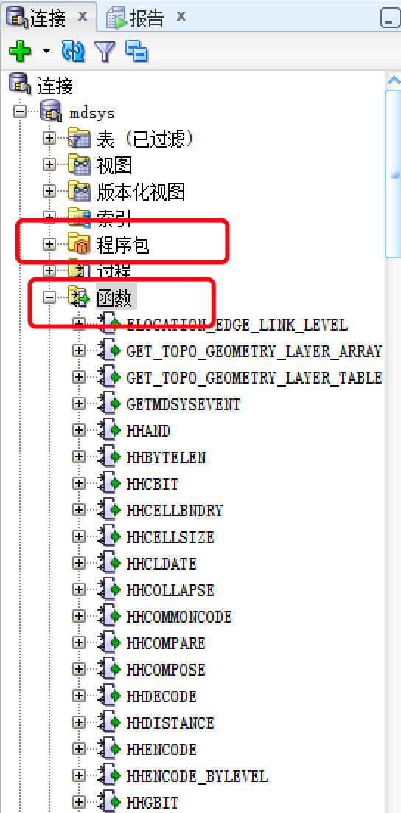

点开一张空间表查看其表结构，与普通数据表类似，地理数据表也有各自的属性列，这与我们在ArcMap中点击右键查看的属性表一致，唯一不同的是它还有一列表示地理信息的列。按照习惯我们通常为其起名为shape。
 
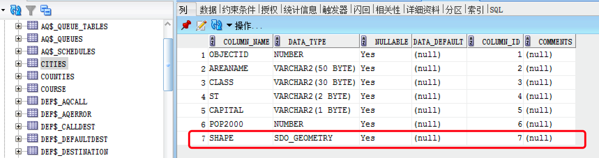

空间数据表的查询与普通表的查询类似，例如：

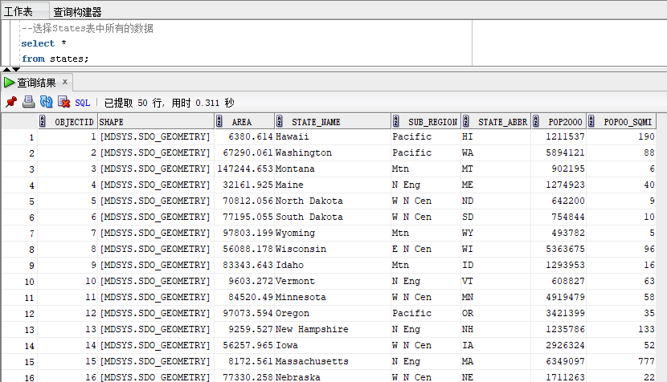

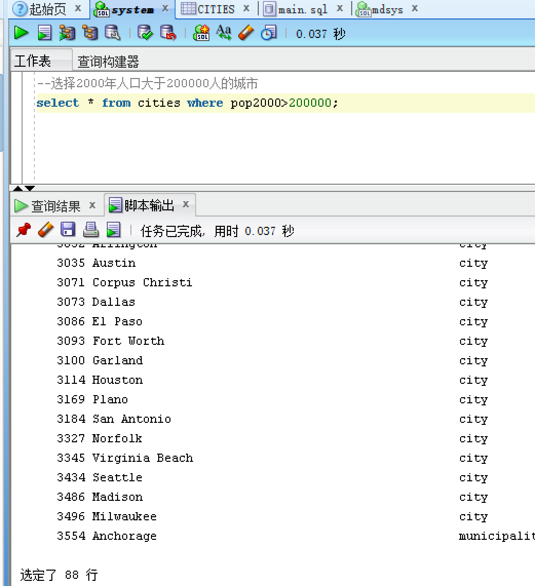

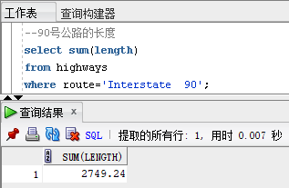

## 5. 简单空间查询

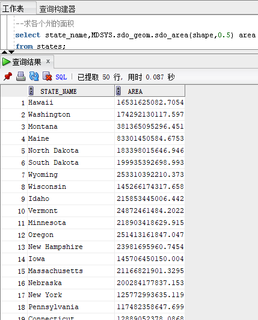

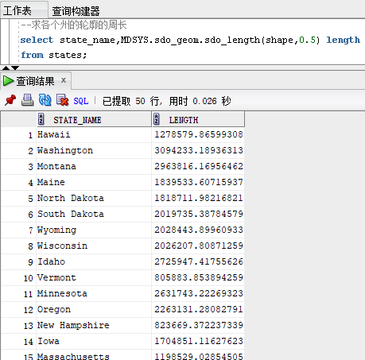

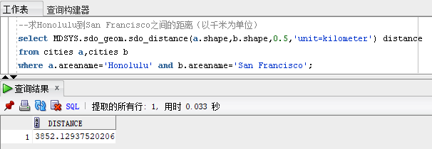

## 6. 高级空间查询

缓冲函数sdo_buffer可以构建缓冲区，与ArcGIS中的缓冲区工具类似，可以对点线面构建缓冲区。

该代码运行时间会很长！

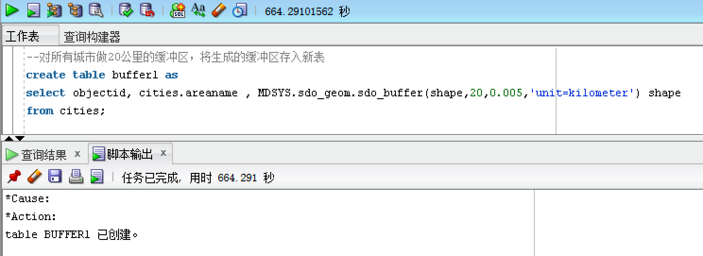

上述代码运行完成后会将查询结果储存到一张新表中，如果ArcGIS能正常连接Oracle，那么可以将数据导出并可视化。

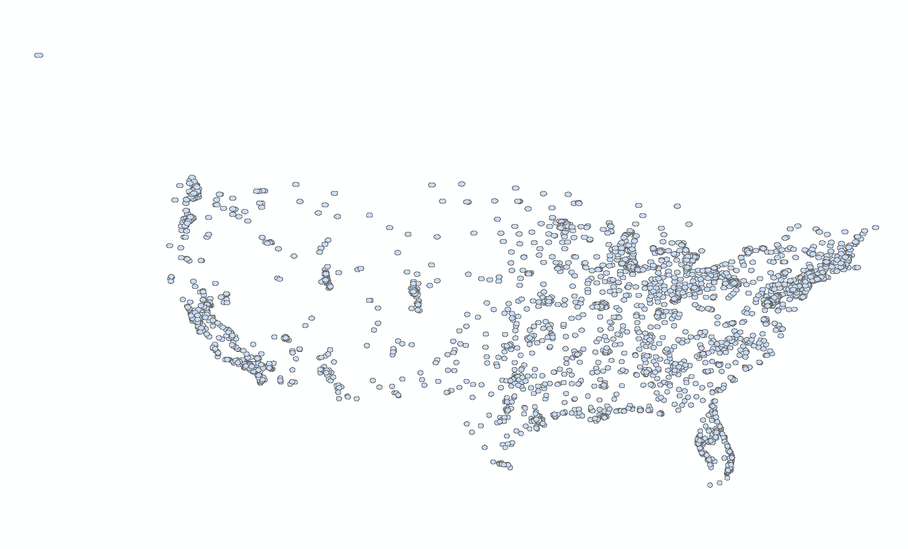

关系分析函数Relate。该函数主要计算两个区域间存在的共同数据信息，其函数结构为：

    RELATE(
        Geometry_A  in SDO_GEOMETRY,
        Mask        in VARCHAR2,
        Geometry_B  in SDO_GEOMETRY,
        Tolerance     in NUMBER
    )

(1)	Geometry_A和Geometry_B表示两个几何体。

(2)	Mask参数可有下面几种选择
    Anyinteract: Geometry_B落在Geometry_A面上包括在边上。
    Contains: Geometry_B完全包含在Geometry_A几何对象中，并且两个几何对象的边没有交叉。 
    Coveredby: Geometry_A完全包含在Geometry_B中，并且这两个几何对象的边有一个或多个点相互重叠。 
    Covers: Geometry_B完全包含在Geometry_A中，并且这两个几何对象的边有一个或多个点相互重叠。 
    Disjoint: 两个几何没有重叠交叉点，也没有共同的边。 
    Equal: 两个几何是相等的。 
    Inside: Geometry_A完全包含在Geometry_B几何对象中，并且两个几何对象的边没有交叉。 
    On: Geometry_A的边和内部的线完全在Geometry_B上。 
    Overlapbdydisjoint: 两个几何对象交迭，但是边没有交叉。 
    Overlapbdyintersect: 两个几何对象交迭，并且边有部分交叉。 
    Touch: 两个几何对象有共同的边，但没有交叉。

(3)	返回值如下

如果两个几何体满足Mask指定的关系时，返回Mask的值，反之返回False；若两个几何体相关且Mask指定了Anyinteract，则返回True，反之返回False。

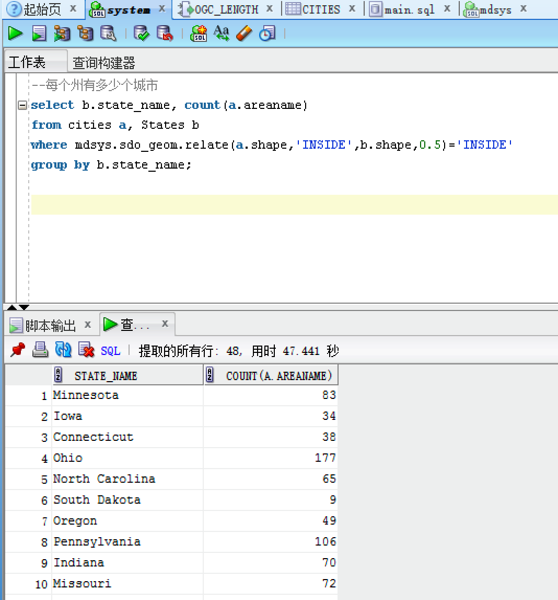

几何组合函数SDO_INTERSECTION、SDO_UNION、SDO_DIFFERENCE与SDO_XOR，几个函数的表现形式如下：

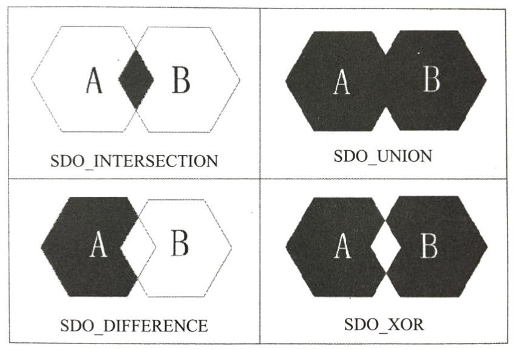

这四个函数的语法结构如下：

    SDO_xxxx(
        Geometry_A  in SDO_GEOMETRY,
        Geometry_B  in SDO_GEOMETRY,
        Tolerance   in NUMBER
    )

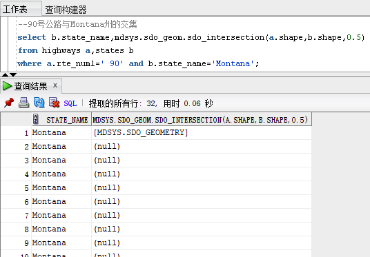

## 7. OGIS标准的函数

因为由ArcGIS导入的数据在Oracle中使用的是SDO_GEOMETRY类型几何类型，因此无法直接使用Oracle中自带的OGIS标准的函数，但是可以转化类型后再使用。

例如：

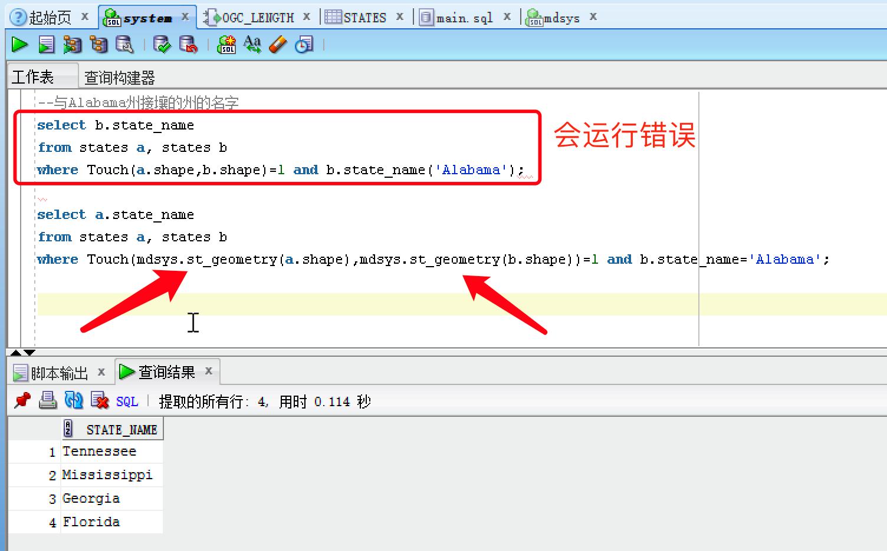

## 8. 课后作业

完成下列空间查询：

(1)	美国哪个/些州与其相邻的州最多？

(2)	70号公路穿过了几个州？

(3)	90号公路附近100公里内的城市的名字