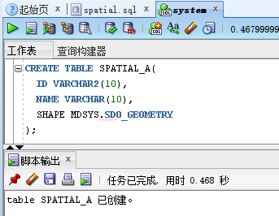
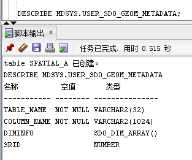
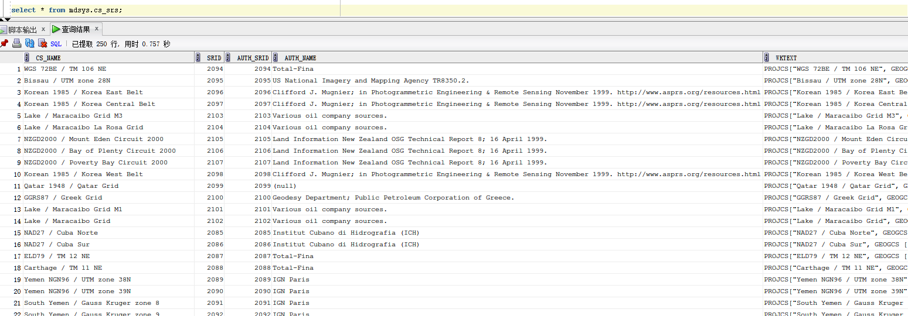
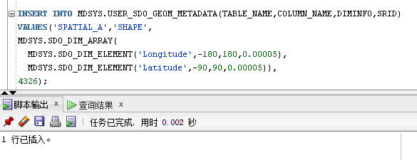
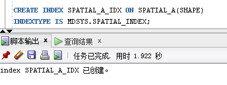
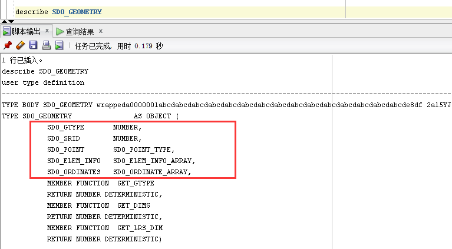
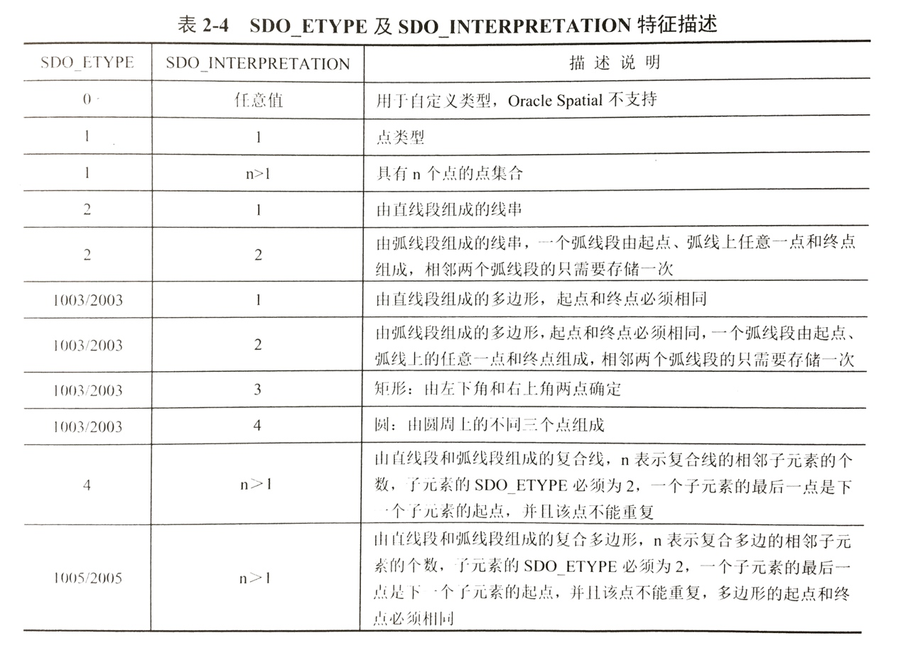
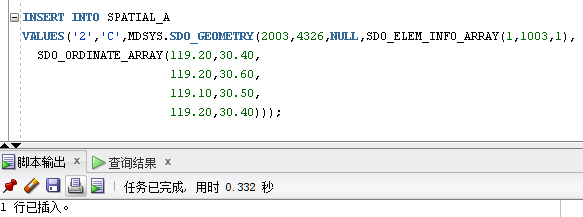
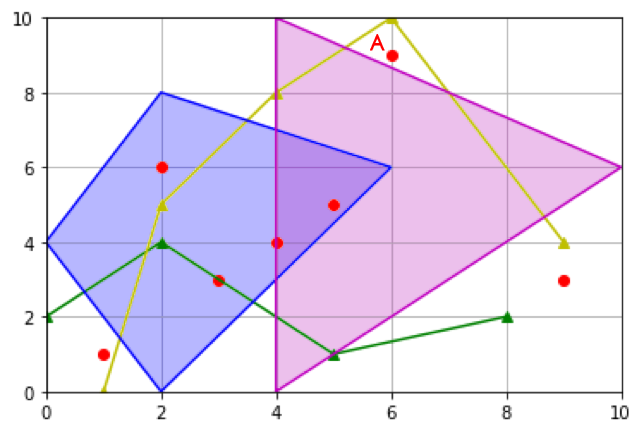

# 实验11  创建空间数据

## 1. 创建空间数据表

创建空间数据表与创建普通数据表类似，需要添加一个空间信息列。空间数据类型为sdo_geometry，该数据类型在mdsys用户下。
 

## 2. 建立空间数据表的元数据

Oracle Spatial是讲一张表的SDO_GEOMETRY列作为一个空间层。要对每个空间层进行验证、创建索引和查询，需要为每个层指定适当的元数据。该数据包含以下信息：维数；每个维度的边界；每个维度的容差；坐标系。每个空间层的信息被存放在mdsys用户下的user_sdo_geom_metadata字典视图中。可以使用describe命令来查看该视图的信息：TABLE_NAME是表名、COLUMN_NAME是指表中的空间信息列名、DIMINFO是指定层的每个维度的信息、SRID定义了储存数据的坐标系。
 

在mdsys用户下cs_srs表中存储了与坐标系相关的数据，可以查询srid和其对应的坐标信息。
 

以第一步新建的表为例，建立其空间元数据。

 
DIMINFO指定了经度与纬度的范围以及容差，SRID=4326指定了坐标系统为WGS84。

## 3. 建立空间索引

在user_sdo_geom_metadata写入元数据后就可以对这张空间数据表建立空间索引，建立空间索引的列为表中的空间信息列。

当完成元数据的写入与空间索引的建立后，这张数据表才能被成为空间数据表。

## 4. Oracle Spatial集合类型以及存储方式

Oracle Spatial的空间数据都存储在空间字段SDO_GEOMETRY中，理解SDO_GEOMETRY是编写Oracle Spatial的关键。SDO_GEOMETRY类型能够存储不同类型的空间数据。点：可以用来存储实体的位置坐标；线串：可用来存储某一路段的位置与形状；多边形：可用来存储城市的边界、商业区等面要素；复杂的集合体：可用来存储复杂的边界信息等。

使用describe 命令可以查看SDO_GEOMETRY 的结构：

红色框中的就是SDO_GEOMETRY必要的数据结构。

（1）SDO_GTYPE

SDO_GTYPE是一个NUMBER型的数值，用来定义存储几何对象的类型。SDO_GTYPE是一个4个数字的整数，其格式为D00T。第一位和最后一位根据几何体的维数和形状采用不同的值，第二位和第三位通常被设为0。

（2）SDO_SRID

SDO_SRID就是空间坐标系，与元数据中的一致。

（3）SDO_POINT

SDO_POINT是一个包含三维坐标X,Y,Z数值信息的对象，用于表示几何类型为点的几何对象。如果SDO_ELEM_INFO和SDO_ORDINATES数组都为空，则SDO_POINT中的（X,Y,Z）为点对象的坐标值，否则，SDO_POINT的值将被忽略（用NULL表示）。

（4）SDO_ELEM_INFO

如果想存储线串和多边形，那就会用到SDO_ELEM_INFO和SDO_ORDINATES。同时使用这两个属性能够对构成一个几何体的不同元素进行定义。SDO_ORDINATES存储所有元素的顶点；SDO_ELEM_INFO存储上述元素的类型和在SDO_ORDINATES的起始地址。

SDO_ELEM_INFO是一个可变长度的数组，每3个数作为一个元素单位，表示坐标是如何存储在SDOORDINATES数组中的。这三个数分别为SDO_STARTING_OFFSET、SDO_ETYPE、SDO_INTERPRETATION。

SDO_STARTING_OFFSET表示每个几何元素第一个坐标在SDO_ORDINATES数组中的存储位置，SDO_ETYPE表示几何对象中每个组成元素的集合类型，SDO_INTERPRETATION的具体作用由SDO_ETYPE是否为复杂元素决定

（5）SDO_ORDINATES

是一个可变长度的数组，用于存储几何对象的实际坐标，是一个最大长度为1048576，类型为Number的数组。

SDO_ORDINATES必须与SDO_ELEM_INFO数组配合使用才具有实际意义。SDO_ORDINATES的坐标存储方式由几何对象的维数决定，如果几何对象为二维，则SDO_ORDINATES的坐标以{x1, y1, x2, y2, …}顺序排列；如果几何对象为三维，则SDO_ORDINATES的坐标以{x1, y1, z1, x2, y2, z2, … }的顺序排列。

## 5. 插入数据

插入点数据：SDO_GTYPE为2001表示插入的数据为二维点数据，SDO_GEOMETRY的后两个参数留空，使用SDO_POINT_TYPE来构造点对象。
 

插入直线段数据：SDO_GTYPE为2002表示插入的数据为二维线串。

sdo_elem_info_array(1,2,1) 的意思时从第一个坐标开始的坐标串表示了一个由直线段构成的线串。
 

插入直线段构成的面数据：SDO_GTYPE为2003表示插入的数据为二维面。

 

除了上述最基本的集合类型，还可以指定不同的SDO_GTYPE与SDO_ETYPE来表示其他更复杂的几何要素。

## 6. 空间查询
可以使用上节课学习的Oracle Spatial函数对空间数据表中插入的数据进行运算，例如使用SDO_LENGTH函数计算插入数据的长度或周长：
 

## 7. 课后作业

建立三张数据表，表名为POINTS，LINES和POLYGONS，分别存储点要素、线要素与面要素。插入元数据并构建空间索引。根据下图所示的图形分别将图中的所有点线面要素插入到各张的表中，并完成下列空间查询。

（1）计算所有线要素的长度与面要素的周长和面积

（2）计算有多少个点落在蓝色的多边形内

（3）求绿色线与蓝色多边形相交部分的长度

（4）求点A到蓝色多边形的距离

（5）求蓝色多边形与紫色多边形相交部分的面积

