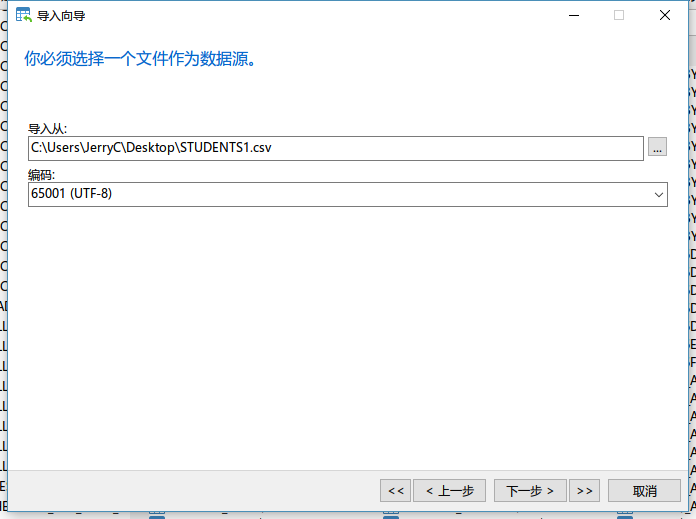

# 实验12  Oracle数据的导入与导出

## 1. 实验10答案 仅供参考

（1）查询美国哪个/些州与其相邻的州最多

    SELECT S1.STATE_NAME, COUNT(*) xiang
    FROM STATES S1, STATES S2
    WHERE MDSYS.SDO_GEOM.RELATE(S1.SHAPE,'TOUCH',S2.SHAPE,0.5)='TOUCH'
    GROUP BY S1.STATE_NAME
    ORDER BY XIANG DESC;

（2）查询70 号公路穿过了几个州？

    SELECT  H.ROUTE, COUNT(*) CHUAN
    FROM HIGHWAYS H, STATES S
    WHERE CROSS(MDSYS.ST_GEOMETRY(H.SHAPE),MDSYS.ST_GEOMETRY(S.SHAPE))=1 AND RTE_NUM1=' 70'
    GROUP BY H.ROUTE;

（3）查询90 号公路附近 100 公里内的城市的名字？

    SELECT COUNT(*) FROM (
        SELECT DISTINCT C.AREANAME
        FROM CITIES C, HIGHWAYS H
        WHERE  MDSYS.SDO_GEOM.SDO_DISTANCE(C.SHAPE,H.SHAPE,0.05,'unit=kilometer')<=100
        AND H.RTE_NUM1=' 90'
        AND C.CLASS='city'
    );

## 2. 实验11答案 仅供参考

建表：

    create table POINTS(
        id varchar2(10),
        name varchar2(10),
        shape mdsys.sdo_geometry
    );
    create table LINES(
        id varchar2(10),
        name varchar2(10),
        shape mdsys.sdo_geometry
    );
    create table POLYGONS(
        id varchar2(10),
        name varchar2(10),
        shape mdsys.sdo_geometry
    );

插入元数据：

    insert into MDSYS.user_sdo_geom_metadata(table_name,column_name,diminfo,srid)
    values('POINTS','SHAPE',mdsys.sdo_dim_array(
        mdsys.sdo_dim_element('X',0,10,0.00005),
        mdsys.sdo_dim_element('Y',0,10,0.00005)),4326);
    insert into MDSYS.user_sdo_geom_metadata(table_name,column_name,diminfo,srid)
    values('LINES','SHAPE',mdsys.sdo_dim_array(
        mdsys.sdo_dim_element('X',0,10,0.00005),
        mdsys.sdo_dim_element('Y',0,10,0.00005)),4326);
    insert into MDSYS.user_sdo_geom_metadata(table_name,column_name,diminfo,srid)
    values('POLYGONS','SHAPE',mdsys.sdo_dim_array(
        mdsys.sdo_dim_element('X',0,10,0.00005),
        mdsys.sdo_dim_element('Y',0,10,0.00005)),4326);

创建空间索引：

    create index points_idx on points(shape) indextype is mdsys.spatial_index;
    create index lines_idx on lines(shape) indextype is mdsys.spatial_index;
    create index polygons_idx on polygons(shape) indextype is mdsys.spatial_index;

插入数据：

    SRID=4326指定了坐标系统为WGS84 度
    3857 投影坐标系 米
    insert into POINTS
    values('0','A',mdsys.sdo_geometry(2001,4326,sdo_point_type(6,9,null),null,null));
    insert into POINTS
    values('1','A',mdsys.sdo_geometry(2001,4326,sdo_point_type(1,1,null),null,null));
    insert into POINTS
    values('2','A',mdsys.sdo_geometry(2001,4326,sdo_point_type(2,6,null),null,null));
    insert into POINTS
    values('3','A',mdsys.sdo_geometry(2001,4326,sdo_point_type(3,3,null),null,null));
    insert into POINTS
    values('4','A',mdsys.sdo_geometry(2001,4326,sdo_point_type(4,4,null),null,null));
    insert into POINTS
    values('5','A',mdsys.sdo_geometry(2001,4326,sdo_point_type(5,5,null),null,null));
    insert into POINTS
    values('6','A',mdsys.sdo_geometry(2001,4326,sdo_point_type(9,3,null),null,null));

    insert into lines
    values('0','L1',mdsys.sdo_geometry(2002,4326,null,sdo_elem_info_array(1,2,1),
    sdo_ordinate_array(1,0,
                       2,5,
                       4,8,
                       6,10,
                       9,4)));
    insert into lines
    values('1','L2',mdsys.sdo_geometry(2002,4326,null,sdo_elem_info_array(1,2,1),
    sdo_ordinate_array(0,2,
                       2,4,
                       5,1,
                       8,2)));

    insert into polygons
    values('0','b',mdsys.sdo_geometry(2003,4326,null,sdo_elem_info_array(1,1003,1),
    sdo_ordinate_array(0,4,
                       2,0,
                       6,6,
                       2,8,
                       0,4)));
    insert into polygons
    values('1','p',mdsys.sdo_geometry(2003,4326,null,sdo_elem_info_array(1,1003,1),
    sdo_ordinate_array(4,0,
                       4,10,
                       10,6,
                       4,0)));

（1）计算所有线要素的长度与面要素的周长和面积

    select mdsys.sdo_geom.sdo_length(shape,0.005) length
    from lines;
    select mdsys.sdo_geom.sdo_length(shape,0.005) 周长,
    mdsys.sdo_geom.sdo_area(shape,0.005) 面积
    from polygons;

（2）计算有多少个点落在蓝色的多边形内

    select count(a.name)
    from points a,polygons b
    where mdsys.sdo_geom.relate(a.shape,'INSIDE',b.shape,0.5)='INSIDE' and b.name='b';

（3）求绿色线与蓝色多边形相交部分的长度

    select mdsys.sdo_geom.sdo_length(mdsys.sdo_geom.sdo_intersection(a.shape,b.shape,0.005),0.005) length
    from lines a,polygons b
    where a.name='L2' and b.name='b';

（4）求点A到蓝色多边形的距离

    select mdsys.sdo_geom.sdo_distance(a.shape,b.shape,0.5) distance
    from points a,polygons b
    where a.name='A' and b.name='b';

（5）求蓝色多边形与紫色多边形相交部分的面积

    select mdsys.sdo_geom.sdo_area(mdsys.sdo_geom.sdo_intersection(a.shape,b.shape,0.005),0.005) area
    from polygons a,polygons b
    where a.name='b' and b.name='p';

## 3. 使用SQL Developer导出数据

首先创建一张数据表，数据任意。
 

 
点击刷新按钮后可以再左侧资源栏中找到这张表，右键选择导出。

首先选择以csv格式导出，如图进行以下设置
 

 
点击下一步完成数据导出的操作，等待片刻，在制定的文件目录下就生成了数据文件。其中csv文件是数据文件，可以用excel打开
 

 
另外导出工具还生成了两个sql文件，其中STUDENT.sql文件是这张表的建表语句，如需恢复数据可以使用这段语句重新建立数据表。

上述方法可以将数据导出为csv通用格式的文件供其他程序使用。如果需要从一个数据库导入数据至另一个数据库使用csv就不太方便，这种情况我们可以使用insert语句的格式来导出数据。在数据导出对话框中进行如下配置。
 
 

点击完成后再指定目录下出现一个sql文件，点击打开可以看到，该文件保留了数据表的建表语句以及插入数据，如需备份数据表，再SQL Developer或者SQL Plus下运行该代码即可。
 

## 4. 使用SQL Developer导入数据

如果导出的数据是insert格式，则导入数据可以直接运行sql脚本即可。如果是其他格式，则可以使用导入工具导入。首先在excel中创建一个csv的数据。
 

现在需要将上述数据集导入到Oracle数据库中。首先我们新建一张空数据表student1，这张表与csv文件中的数据列保持一致。
 

点击刷新按钮后可以再左侧资源栏中找到这张表，右键选择导入数据。
 

打开刚刚创建的csv文件

 
数据预览、导入方法默认即可

 
在选择列界面将所有列全部选中到右侧，点击下一步。

 
此时需要对列进行匹配，将数据表中的各列与csv文件中的各列相匹配，此处因为二者列名完全相同，因此默认已完全匹配，如果列名不同，则需要手动选择。

 

全部设置完后点击下一步完成即可。稍等片刻数据已经全部导入到数据表中了。
 

## 5. 在Navicat中导入导出数据

在navicat中找到要导出的数据表，点击右键选择导出向导，在向导中可以选择导出的数据格式。

 
点击下一步设置导出数据的路径

 
勾选包含列标题，点击下一步完成向导开始导出。

 
使用导出Navicat工具也可以导出为insert格式的数据，但是生成的SQL文件并不会自带建表语句。但是使用Navicat可以使用转储sql文件来同时保留建表语句与insert语句。在要导出的数据表上点击右键，选择转储SQL文件->结构和数据，直接指定保存路径即可。
 

使用Navicat导入数据也类似，使用导入向导，操作与SQL Developer类似。
 

 

导入模式可以选择是否需要将原来的数据删除。
 

点击下一步开始即可完成数据的导入。

## 6. SQL优化

在select语句中避免使用*

 

合理使用where语句中的条件
 

使用“<=”代替“<”
 

调整where语句条件的顺序
 

建立索引也可以提高查询效率，在这不过多赘述。

## 7. 课后作业

练习导入导出数据表，尝试使用其他格式导入导出数据，数据源任选之前实验创建的数据表。

尝试优化之前作业中的查询题目。
