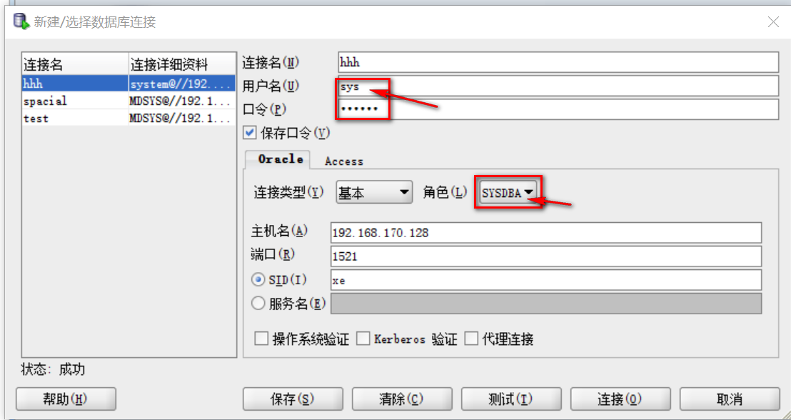
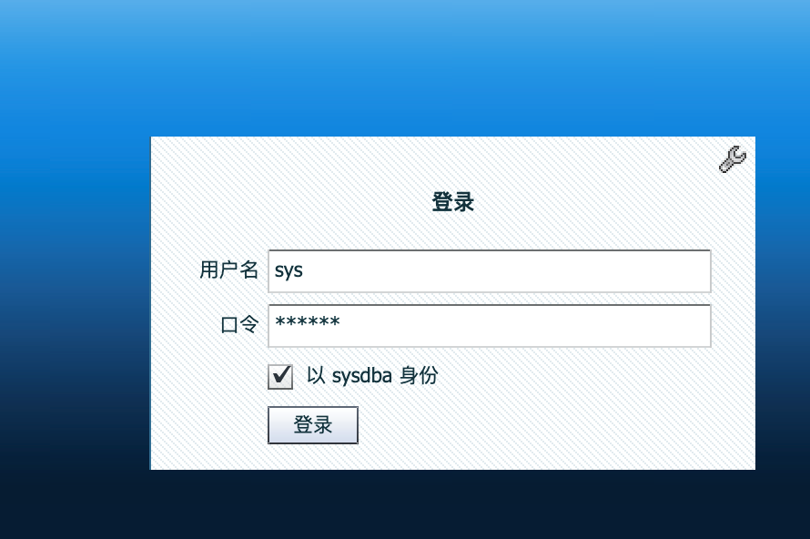
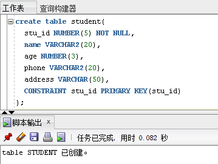
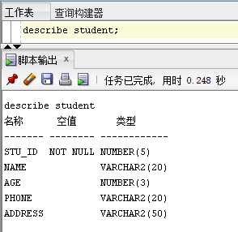
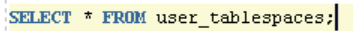

# 实验4-1  SQL数据定义语言

## 一、用户密码过期、锁定和权限问题

## 1、使用管理员用户sys登陆

在进行实验时如果出现以下提示：ORA-28001: the password has expired，那么说明Oracle数据库用户的密码已经过期，那么可以通过以下方式处理。

使用管理员用户sys登陆，以下三种方法选择其中一个即可。

## （a）使用SQL Developer登录

打开SQL Developer，点击或右击已有的连接，修改属性如下，即可登录。

## （b）使用OEM页面

首先尝试使用sys用户登陆OEM页面。输入用户名sys，口令oracle（如有修改请使用修改后的口令），注意勾选以sysdba身份登陆。

## （c）使用SQL PLUS

打开cmd，输入下列登陆命令，用户名密码分别为sys和oracle，在连接字符串的末尾添加上as sysdba。

如果上述方法无效，则可以按照实验1的步骤重新解压一个虚拟机，在VMWare Player中打开，重新解压的虚拟机在登陆时可能会出现类似the password will expire的提示，但是可以暂时成功登陆，但是在登陆后务必第一时间修改密码。

## 2、密码修改和用户解锁

sys用户登录成功后，有以下两种方法解决用户锁定、修改密码，任选其中一种即可。

（a）	按照实验2中解锁scott用户的方法，在OEM中将提示密码已过期的用户重新解锁并设置口令。

（b）	在SQL Developer中输入以下命令修改用户密码及解锁，其中SCOTT为用户名，tiger为口令

大家在实验二中所创建的用户是赋予的CONNECT的角色，是临时用户，没有建表的权限。针对以上问题，请大家使用scott用户，口令tiger，以完成以下实验。

## 二、用户模式

在 Oracle 数据库中，为了便于管理用户所创建的数据库对象（数据表、索引、视图等），引入了模式的概念，这样某个用户所创建的数据库对象就都属于该用户模式。

模式是一个数据库对象的集合。模式为一个数据库用户所有，并且具有与该用户相同的名称，比如SYSTEM模式、SCOTT模式等。在一个模式内部不可以直接访问其他模式的数据库对象，即使在具有访问权限的情况下，也需要指定模式名称才可以访问其他模式的数据库对象。

模式对象是由用户创建的逻辑结构，用以存储或引用数据。比如段、数据表、索引，约束、视图、过程以及程序包等。

简单地说，模式与模式对象之间的关系就是拥有与被拥有的关系，即模式拥有模式对象；而模式对象被模式所拥有。

Oracle是不支持创建自定义模式的，每个用户会有一个默认的和用户名相同的模式。创建模式需要通过创建用户来实现。

在SCOTT模式下，通过检索user_tables来显示SCOTT模式下的数据表：

## 三、数据表的创建、修改和删除

## 1. 表的创建

使用create table语句来创建数据表，其语法规则如下：

    create table [schema.] table_name(
        column_name data_type [default expression] [constraint]
        [,column_name data_type [default expression] [constraint]]
        [,column_name data_type [default expression] [constraint]]
        [,…]
    );

例如：

表创建成功后可以使用describe命令查看表结构。

使用create table命令创建数据表时是将其存放在指定用户的默认表空间中。有时建表时不一定要存放在默认表空间中，可以指定存放该表的表空间tablespace，对应表格的存储文件（*.dbf）。

查看所有的表空间：

创建表student1，在建表语句后追加如下内容，指定该表存放的表空间为mashangjing（实验2要求创建的与自己姓名汉语拼音相同的表空间，也可以通过create tablespace命令创建表空间）：

如需查看表与表空间的对应关系，可以运行语句:

    select table_name, tablespace_name from user_tables;

从结果中可以看出，student表是存放在scott用户默认的表空间users中，而student1表存放在指定的mashangjing表空间中。

## 2. 表的修改

创建一个数据表后可以再对数据表进行修改操作，包括增加和删除列、更新列、重命名表等。

使用alter table… add命令可以向表中增加列。例如需要向student表中新增一列class，类型为VARCHAR2(20)

执行代码后运行describe命令查看表结构描述：

可以看到已经新增了一个class列。

在表中如需要删除已存在的列，需要使用alter table…drop column;语句，例如需要将上面新建的class列删除：

执行代码后运行describe命令查看表结构描述：

使用alter table... rename... to …语句可以修改某列的列名。将student表中name列的列名修改为stu_name。

执行代码后运行describe命令查看表结构描述：

使用alter table… modify…可以对某列的数据类型进行修改，但是在数据类型修改时需要注意两点：

(1) 一般情况下，只能将数据的长度由短向长改变，而不能由长向短改变。

(2) 当表中没有数据时，可以将长度由长向短改变，也可以把某种类型改为另一种类型

将stu_name列的类型改为VARCHAR2(30)。

执行代码后运行describe命令查看表结构描述：

使用alter table … rename to语句可以修改表名。例如将表student的表名修改为nnu_student：

运行成功后使用`select table_name, tablespace_name from user_tables;`查看表名。

此时需要使用describe nnu_student命令才能查看新表的结构。

## 3. 表的删除

删除数据表使用drop table语句。例如删除student1表：

## 五、课后作业

#### 1. 使用SCOTT用户登录数据库，创建以下三张数据表，数据类型自拟，合理即可：

- 学生表：Student (Sno, Sname, Ssex, Sage, Sdept)
- 课程表：Course (Cno, Cname, Cpno, Ccredit)
- 选课表：SC (Sno, Cno, Grade)

#### 2. 编写实验报告。