# 实验4-2  SQL数据定义语言（2）

## 1. 表的完整性约束

数据库的完整性是指数据库中数据的完整性与相容性，为了能保证数据库插入数据具有完整性，通常情况需要使用各种完整性约束。

**非空约束**表示某列的值是不可缺少的，使用NOT NULL关键字即可定义非空列。在创建表时可以在列定义后加上NOT NULL关键字进行约束。如下例，stu_id与name列都被定义为非空，添加非空约束后这两列在插入数据时不能有空数据。

    create table scott.student(
        stu_id NUMBER(5) NOT NULL,
        name VARCHAR2(20) NOT NULL,
        age NUMBER(3),
        phone VARCHAR2(20),
        address VARCHAR(50),
        CONSTRAINT stu_id PRIMARY KEY(stu_id)
    );

对已存在的数据表可以通过使用alter语句添加NOT NULL约束。例如：

    alter table student modify name NOT NULL;

如果需要删除某列的非空约束，将上述语句的NOT NULL修改为NULL即可。

使用primary key定义**主键约束**，在创建表时，如果为主键约束指定名称，需要使用constraint关键字，即constraint … primary key语句。例如上面使用过的建表语句，constraint关键字后的stu_id为约束名，primary key后括号内的列名为需要建立主键的列。

    create table scott.student(
        stu_id NUMBER(5) NOT NULL,
        name VARCHAR2(20) NOT NULL,
        age NUMBER(3),
        phone VARCHAR2(20),
        address VARCHAR(50),
        CONSTRAINT stu_id PRIMARY KEY(stu_id)
    );

如果建表时不想定义主键约束的约束名，则上述代码可以简化成：

    create table scott.student(
        stu_id NUMBER(5) NOT NULL PRIMARY KEY,
        name VARCHAR2(20) NOT NULL,
        age NUMBER(3),
        phone VARCHAR2(20),
        address VARCHAR(50)
    );

唯一存在的表添加主键列可以使用alter语句：

    alter table student1 add constraint stu_pk primary key(stu_id);

上述代码使用alter语句将stu_id设为主键约束，约束名为stu_pk。注意：当表中已经存在主键约束时该语句会运行失败。

UNIQUE约束时指**唯一性约束**，用来保证表中某一列或某几列组合起来不重复。

    create table scott.student3(
        stu_id NUMBER(5) NOT NULL PRIMARY KEY,
        name VARCHAR2(20) CONSTRAINT stu_uk UNIQUE,
        age NUMBER(3),
        phone VARCHAR2(20),
        address VARCHAR(50)
    );

上述代码为name列创建了UNIQUE约束，约束名为stu_uk。
使用alter语句可以为已存在的列添加UNIQUE约束

    alter table student3 add constraint stu_uk unique(name);

**外键约束**是指引用另一张表中的某一列或某几列，外键约束的作用时让某两个表通过外键建立关系。下面使用references实现外键约束。首先创建class表，该表有班级名称与班级编号两列，定义班级编号为主键。

    create table class(
        class_no number(4) NOT NULL PRIMARY KEY,
        class_name varchar2(20)
    );

新建一张student4表，其中，class_id列需要参照class表的class_no列。

    create table scott.student3(
        stu_id NUMBER(5) NOT NULL PRIMARY KEY,
        name VARCHAR2(20) CONSTRAINT stu_uk UNIQUE,
        age NUMBER(3),
        class_id number(4) references class(class_no)
    );

该表中的class_id列引用了class表中的class_no列。引用列与被引用列的列名可以不同，但是数据类型必须一致。使用alter语句为已存在的数据表添加外键。先创建一张没有外键的表

    create table scott.student4 (
        stu_id NUMBER(5) NOT NULL PRIMARY KEY,
        name VARCHAR2(20) CONSTRAINT stu_uk UNIQUE,
        age NUMBER(3),
        class_id number(4)
    );

运行下列语句可以为student表添加外键

    alter table student4
    add constraint stu_fk foreign key(class_id)
    references class(class_no);

删除主键约束、unique约束或外键约束都可以使用alter table… drop constraint 语句。例如删除student表中名为stu_pk的主键约束可以使用下列代码：

    alter table student drop constraint stu_pk;

## 2. 索引的创建、修改与删除

索引是对数据库表中一列或多列的值进行排序的一种结构，使用索引可快速访问数据库表中的特定信息。

创建索引的命令是CREATE INDEX，其基本格式为：

    create [unique] index <索引名> on [模式.]<表名>
    (<列名>[<次序>][,<列名>[<次序>]]…));

生成student3表，该表为nnu_student表的完整复制。接下来，在student3表的STU_ID列建立唯一性索引sno。

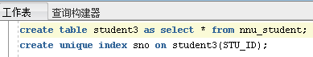

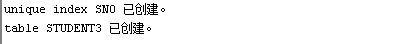

将索引sno重命名为nnu_sno：

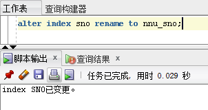

将索引nnu_sno设置为可用：

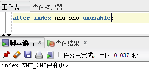

对于不再使用的索引，应该将其及时删除，DROP INDEX语句用于删除指定索引，将索引nnu_sno删除：

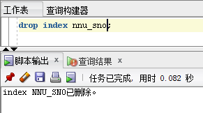

## 3. 视图的创建、修改和删除

视图与物理保存在数据库中的基本表不同，是从一个或几个基本表（或视图）导出的表，它是一个虚拟的表。数据库中只存放视图的定义，而不存放视图对应的数据，这些数据仍存放在原来的基本表中。基本表中的数据发生变化，从视图中查询出的数据也就随之改变了。从这个意义上讲，视图就像一个窗口，透过它可以看到数据库中自己感兴趣的数据及其变化。

视图一经定义，就可以和基本表一样被查询、被删除，也可以在一个视图之上再定义新的视图，但对视图的更新（增、删、改）操作则有定的限制。视图的维护由数据库管理系统自动完成。

使用视图的优点包括：安全、简化用户SQL语句、防止错误、提高性能和使教据易于理解等。

创建视图的语法如下：

    create [or replace] [force] [noforce] view [用户方案.] <视图名>
        [(列名[,…n])]
    as select 语句
        [with check option [constraint 约束名]]
        [with read only];

创建视图需要相应的权限，登录sys用户：

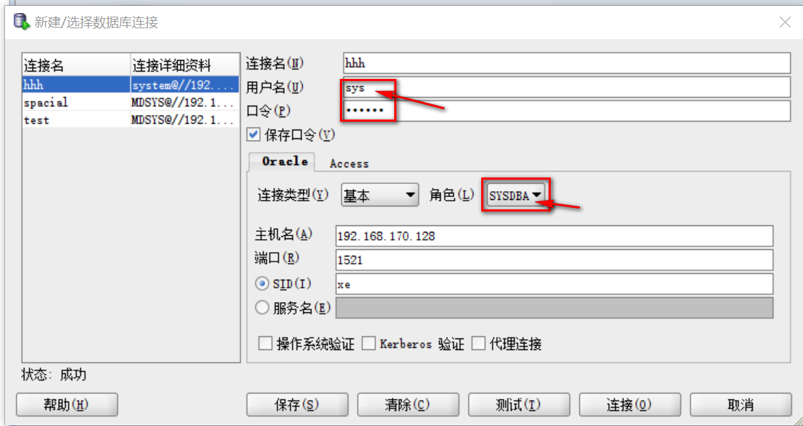

输入以下命令在sys用户中赋予scott用户创建视图的权限：

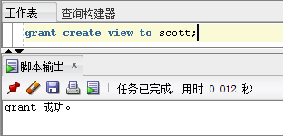

以scott用户登录，给scott用户中的表nnu_student创建视图student：

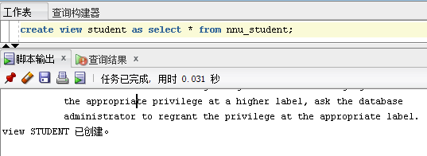

执行describe命令查看视图student结构：

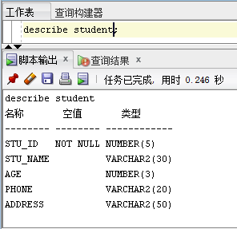

使用 create or replace view 命令修改视图：

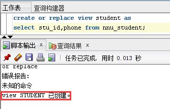

执行describe命令查看视图student结构：

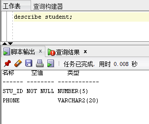

可以看到视图student已被修改。

使用DROP VIEW命令删除视图，将视图student删除：

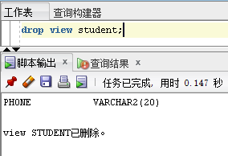

## 4. 课后作业

完成实验中涉及到的操作，将每一步骤的SQL语句及结果截图，编写实验报告。