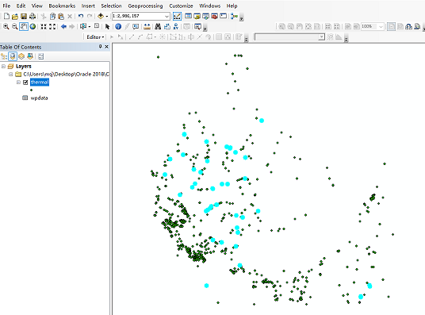
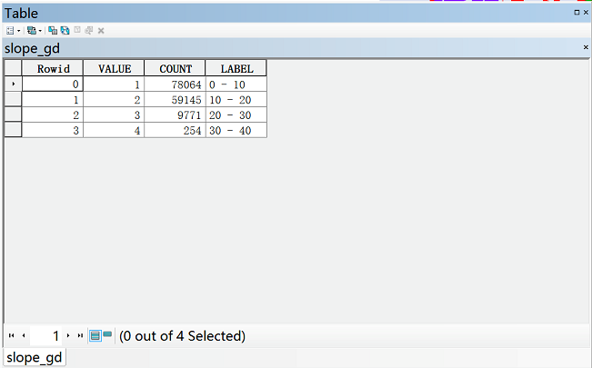

# 实验3  SQL*Plus基本操作

## 1. 使用ArcGIS Desktop按属性查询

所需数据：thermal.shp,包含899个热井（字段TYPE=w）和泉眼（字段TYPE=s）的shapefile文件，字段temp表示水温（˚C）

在ArcGIS中加载数据，右击图层打开属性表，选择左上角按钮选择Select By Attributes按属性查询：

查看温度高于60 ˚C的热井温泉有几个，分布在哪些位置。在where中写入条件"TEMP" >60 AND "TYPE" = 's'

点击应用，查看已选中的结果。

## 2. 由位置选择要素，并制作图表

所需数据： idcities.shp——爱达荷州654个地点shapefile文件；snowsite.shp——爱达荷州及其毗邻州的206个滑雪站的shapefile文件。

要求用“由位置选择要素”的方法，选择距爱达荷州的Sun Valley 40英里（Miles）范围之内的滑雪站（24个），并创建一个散点图（Y字段为ELEV；X字段为SWE_MAX；标题为Elev_SweMax），输出为Elev_SweMax.jpg。

首先在ArcGIS中加载上述两个数据，右键点击Layers，选择Properties，将整个Data Frame的现实单位修改为Miles

先选择出Sun Valley这个城市，点击菜单栏中的selection，选择Select by attributes，图层设置为idcities。在where中写入条件"CITY_NAME" = 'Sun Valley'。

点击确定，此时将Sun Valley选择出来了。

再次点击selection，选择select by location，将目标图层设置为snowsite，源图层设置为idcities，空间条件选择为within a distance，距离设为40miles。点击确定即可选择出距离Sun Valley 40 miles 的滑雪场了。

右键点击Snowsite图层，打开属性表，点击左上角的小按钮选择Create Graph创建统计图。

一个散点图（Y字段为ELEV；X字段为SWE_MAX）

点击下一步设置标题（标题为Elev_SweMax），在此处可以选择做图的数据是全部数据还是部分选择的数据。设置完毕后点击Finish结束。

在图像上点击右键选择Export可以将图表导出为jpg格式的图片。

## 3. 空间与属性组合的数据查询

所需数据：thermal.shp,包含899个热井（字段TYPE=w）和泉眼（字段TYPE=s）的shapefile文件，字段temp表示水温（˚C）；idroads.shp，爱达荷州主要道路的shapefile文件。

假设某公司要在爱达荷州确定温泉胜地的候选地点，选点的两个标准为：（1）温泉必须位于主要道路2 miles范围内；（2）温泉的温度必须高于60˚C。

（1）加载数据，显示单位Display为Miles。

（2）首先选选择距离道路2miles范围内的点，使用Select by location，目标图层选择thermal，源图层选择idroads，within a distance of 2 Miles. 

问题1，此时有多少温泉和热井被选中？

（3）然后再根据温度选择需要的点。使用Select by attributes，Select from current selection，"TYPE " = 's ' AND "temp" > 60

（4）使用地图提示功能。右击thermal\Properties\Display，勾选Show Map Tips，提示字段选择为TEMP

问题2，距道路2mi范围内且温度高于70˚C的热井和温泉有多少个？

## 4. 栅格数据查询

所需数据：slope_gd，坡度栅格文件；aspect_gd，坡向栅格文件。加载上述数据。若未启用空间分析模块，点击Customize中的Extensions，勾选启用Spatial Analyst。

在slope_gd图层点击右键查看属性表可知，该栅格数据集中2表示坡度格网内的坡度为10˚到20˚之间，Aspect_gd也类似。

在工具箱中找到Extract by Attributes工具，编写下列条件即可查询坡度在10˚到20˚之间的地块。

## 5. 使用ArcGIS Pro按属性查询

从ArcGIS平台架构上来看，ArcGIS Pro属于应用层，是为新一代Web GIS平台，面向GIS专业人士（例如GIS工程师、GIS科研人员、地理设计人员、地理数据分析师等），全新打造的一款高效、具有强大生产力的桌面应用程序。ArcGIS Pro除了良好地继承了传统桌面软件（ArcMap）的强大的数据管理、制图、空间分析等能力，还具有其独有的特色功能，例如二三维融合、大数据、矢量切片制作及发布、任务工作流、时空立方体等。

打开ArcGIS Pro，可能会弹出一个安全警报窗口，选择是，等待

新建一个项目，选择保存路径和文件名

右击Map，选择Add Data添加数据，添加thermal.shp，数据说明见步骤1。

在工具栏中选择Map，Select By Attributes

Input Rows输入行选择thermal，点击Add Clause添加子句，选择水温大于60度的温泉

## 6. 使用ArcGIS Pro按位置查询

## 7. 课后作业

使用ArcGIS Desktop或者ArcGIS Pro完成1到4部分的实验，并撰写实验报告。