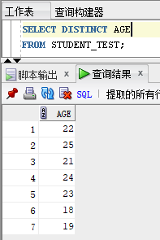
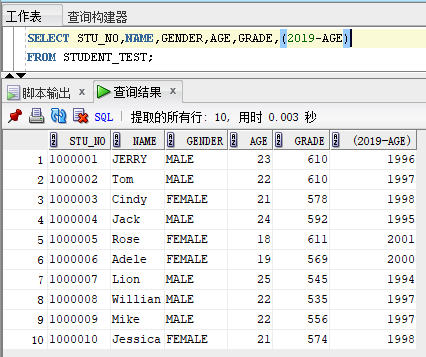

# 实验5  SQL简单查询

## 1. 创建表并插入数据

为了接下来的实验我们先创建一张数据表，该表表名为student_test，其中包含以下列：学号（stu_no）、学生姓名（name）、性别（gender）、年龄（age）、高考成绩（grade）。其中以学号为主键。

建表语句如下：

数据插入使用Insert into values语句，其语法规则在后续实验中介绍。此处输入以下语句，插入数据，进行本实验后续查询。

    insert into student_test values ('1000001','JERRY','MALE',23,610);
    insert into student_test values ('1000002','Tom','MALE',22,610);
    insert into student_test values ('1000003','Cindy','FEMALE',21,578);
    insert into student_test values ('1000004','Jack','MALE',24,592);
    insert into student_test values ('1000005','Rose','FEMALE',18,611);
    insert into student_test values ('1000006','Adele','FEMALE',19,569);
    insert into student_test values ('1000007','Lion','MALE',25,545);
    insert into student_test values ('1000008','Willian','MALE',22,535);
    insert into student_test values ('1000009','Mike','MALE',22,556);
    insert into student_test values ('1000010','Jessica','FEMALE',21,574);

代码运行成功后会出现上述字样。此时使用select * 语句查询全表数据，即可看到数据已经成功插入。

## 2. 简单查询

在之前的学习中我们多多少少运用到了一些查询语句，比如要查看一张表中所有的数据可以使用select * from table; 语句。那么接下来简要介绍一下SQL的select语句。Select语句的完整结构如下：

    select [all | distinct]
    {* | expression | colomn1_name [,colomn2_name]
    from {table1_name [,table2_name]
    [where condition]
    [group by expression]
    [having condition]
    [union]
    [order by expression [asc|desc]]

首先，语句中*的意思是指查询所有列，如果需要查询特定列可以在select语句中指定列名，比如查询所有人的学号与姓名：

使用distinct关键字可以对结果去重：

select语句中也可以使用where语句来指定过滤条件。首先where子语句中可以使用=、!=、>、<、>=、<=等操作符对数值进行比较，也可以使用and、or、not等逻辑操作符对逻辑进行判断，看以下几个例子：

1）找出所有男学生的记录

2）找出所有分数大于600分的记录

3）找出所有22岁男学生的姓名

4）找出所有年龄不是19岁的女学生的姓名和分数

除了上述的操作符，Oracle的查询语句还支持下列的操作符：between … and … （在两值之间）、in（在列表中匹配） 、like（匹配字符串）、 is null（判断空值）。

1）找出所有年龄在19到22岁之间且分数在570到610之间的所有记录

2）找出所有年龄为19、22、23岁的所有记录

3）找出所有名字以J开头的学生

使用order by语句可以对数据进行排序

1）按年龄升序排列

2）按成绩降序排列

3）先按年龄升序排列，再按成绩降序排列

在使用select语句时，对于数值数据和日期数据，都可以使用算术表达式进行计算。例如，在表中新增一列，计算所有人的出生年份：

计算后 “2019-AGE”这样显示不太友好，为了增强可读性，可在查询结果中为列指定别名：

## 3. 课后作业

使用HR用户自带的Employees数据表完成以下查询（注：Employees表中需包含的字段为：EMPLOYEE_ID雇员编号、FIRST_NAME名、LAST_NAME姓、EMAIL邮箱、PHONE_NUMBER电话号码、HIRE_DATE雇佣日期、JOB_ID工作编号、SALARY薪水、COMMISSION_PCT员工提成、MANAGER_ID部门经理编号、DEPARTMENT_ID部门编号）：

1）查找工资高于10000美元的员工的姓名

2）查找部门号为50中工资不足3000美元的员工的所有记录

3）查找工资高于5000美元的男性员工并按工作编码降序排列

4）找出First name以D开头的员工并按照工资的升序排列

5）找出Last name中有字母a员工姓名

6）找出First name不以E开头，Last name有4个字母，部门号为30 50 80的员工

7）找出提成不为空的工作编号

8）找出部门经理编号为122、薪水大于2000且小于3000的雇员编号及姓名，并按照工资升序排列

9）显示表中所有列和调整薪水后增加10%薪水后的列，并为该列设置别名”调薪后薪水”

10）将提成增加0.1，找出电话以011开头、部门经理编号为100、薪水小于12000的雇员的全部信息，将增加后的提成命名为COMMISSION_PCT2