# 实验5  SQL简单查询

## 1. 实验5答案 仅供参考

（1）查找工资高于10000美元的员工的姓名
    SELECT FIRST_NAME||' '||LAST_NAME
    FROM EMPLOYEES
    WHERE SALARY >10000;

（2）查找部门号为50中工资不足3000美元的员工的所有记录
    SELECT *
    FROM EMPLOYEES
    WHERE DEPARTMENT_ID=50 AND SALARY<3000;

（3）查找工资高于5000美元且部门经理编号大于120小于150的员工并按工作编码降序排列
    SELECT EMPLOYEE_ID, FIRST_NAME||' '||LAST_NAME
    FROM EMPLOYEES
    WHERE SALARY >5000 AND EMPLOYEE_ID BETWEEN 120 AND 150
    ORDER BY EMPLOYEE_ID DESC;

（4）找出First name以D开头的员工并按照工资的升序排列
    SELECT EMPLOYEE_ID, FIRST_NAME||' '||LAST_NAME
    FROM EMPLOYEES
    WHERE FIRST_NAME LIKE 'D%'
    ORDER BY SALARY;

（5）查找部门号为50中工资不足3000美元的员工的所有记录
    SELECT EMPLOYEE_ID, FIRST_NAME||' '||LAST_NAME
    FROM EMPLOYEES
    WHERE LAST_NAME LIKE '%a%';

（6）查找部门号为50中工资不足3000美元的员工的所有记录
    SELECT EMPLOYEE_ID, FIRST_NAME||' '||LAST_NAME
    FROM EMPLOYEES
    WHERE FIRST_NAME NOT LIKE 'E%' AND LAST_NAME LIKE '____' AND DEPARTMENT_ID IN (30,50,80);

（7）查找部门号为50中工资不足3000美元的员工的所有记录
    SELECT DISTINCT JOB_ID
    FROM EMPLOYEES
    WHERE COMMISSION_PCT IS NOT NULL;

（8）查找部门号为50中工资不足3000美元的员工的所有记录
    SELECT EMPLOYEE_ID, FIRST_NAME||''||LAST_NAME
    FROM EMPLOYEES
    WHERE MANAGER_ID=122 AND SALARY BETWEEN 2000 AND 3000
    ORDER BY SALARY;

（9）查找部门号为50中工资不足3000美元的员工的所有记录
    SELECT EMPLOYEE_ID,FIRST_NAME,LAST_NAME,EMAIL,PHONE_NUMBER,HIRE_DATE,JOB_ID,SALARY,COMMISSION_PCT,MANAGER_ID,DEPARTMENT_ID,SALARY*1.1 调薪后薪水
    FROM EMPLOYEES;

（10）查找部门号为50中工资不足3000美元的员工的所有记录
    SELECT EMPLOYEE_ID,FIRST_NAME,LAST_NAME,EMAIL,PHONE_NUMBER,HIRE_DATE,JOB_ID,SALARY,COMMISSION_PCT,MANAGER_ID,DEPARTMENT_ID,COMMISSION_PCT+0.1 COMMISSION_PCT2
    FROM EMPLOYEES
    WHERE PHONE_NUMBER LIKE '011%' AND MANAGER_ID=100 AND SALARY<12000;
 
## 2. 字符串函数

在Oracle数据库函数中，字符串函数是比较常见的函数之一。在使用字符串常数时，可以接收字符参数，这些字符可以是一个任意有效的表达式，也可以来自于表中的一列，其返回值类型为字符类型或数值类型。下面简略介绍几个Oracle所提供的字符串函数的应用：

（1）获取字符串长度

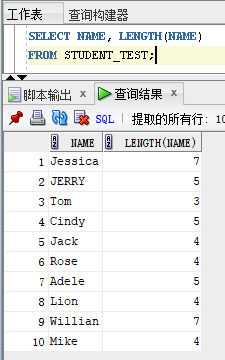

（2）连接字符串

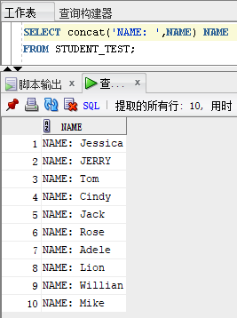

（3）截取字符串

    格式1： substr (string string, int a, int b);
    string 需要截取的字符串
    a 截取字符串的开始位置（注：当a等于0或1时，都是从第一位开始截取）
    b 要截取的字符串的长度
    
    格式2： substr (string string, int a);
    string 需要截取的字符串
    a 可以理解为从第a个字符开始截取后面所有的字符串。

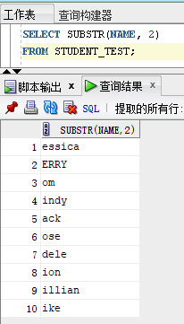
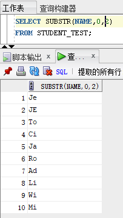

（4）字母大小写

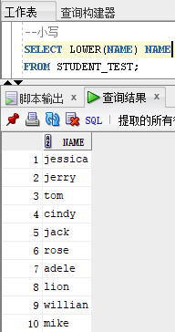
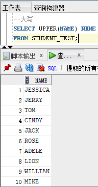
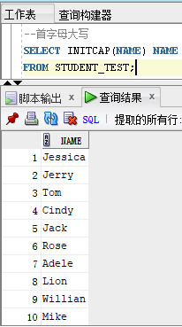

（5）替换字符串

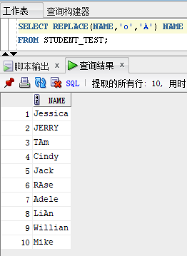

## 3. 数值函数

针对数值型函数，Oracle提供了丰富的内置函数进行处理。数值函数的输入参数和返回值都是数值型。下面的例子是Oracle数据库中使用的比较常见的数值函数的用法，同时数值函数不仅局限于此，更多的函数以及用法可以参考官方文档或者网络检索。

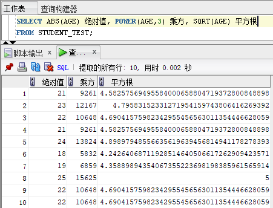

## 4. 聚集函数

检索数据不仅仅是把现有数据简单地从表中取出来，很多情况下，还需要对数据执行各种统计计算。在Oracle数据库中，执行统计计算需要使用聚合函数，常做的统计计算有求平均值、求和、求最大值、求最小值等。这些函数在分组查询中经常用到。

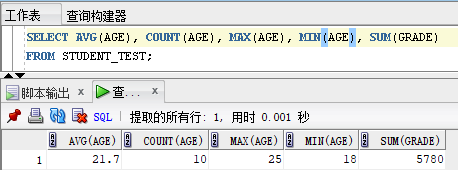

## 5. 数值计算

有了上述函数，那么我们还可以在select语句中结合一些简单地函数进行数值的计算：

（1）查找十年后学生的年龄小于30岁的学生的学号和姓名

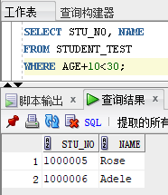

（2）求同学们年龄的极差

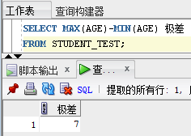

## 6. 分组查询

在数据库查询中，分组是一个非常重要的应用。分组是指将数据表中的所有记录，以某个或某些列为标准，划分为一组。例如，在一个存储了各个地区学生的表中，以学校为标准，可以将所有学生的信息划分为多个组。在本实验中使用的学生表也可以进行分组，例如按照性别分组或者按照年龄分组等。进行分组查询需要使用GROUP BY子句。

（1）分别统计男生与女生的平均成绩并保留两位小数

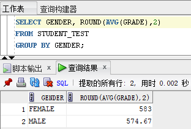

（2）按照性别与年龄分组计算平均成绩并按照成绩降序排列

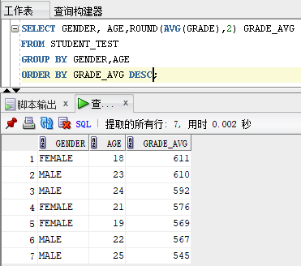

HAVING子句通常与GROUP BY子句一起使用，在完成对分组结果的统计后，可以使用HAVING子句对分组的结果进行进一步的筛选。

按照性别与年龄分组计算平均成绩，选取平均成绩大于600分的组并按照成绩降序排列：

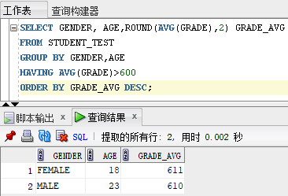

HAVING语句与WHERE语句的用法是不同的，WHERE语句是对整个数据集筛选，HAVING语句是对分组后的结果筛选。而且两个子句的位置不同，HAVING语句必须要跟在GROUP BY语句的后面，而WHERE语句是在GROUP BY语句的前面。而ORDER BY语句永远是在SELECT语句的最后。

选取年龄大于19岁的同学，按照性别与年龄分组计算平均成绩，并按照成绩降序排列：

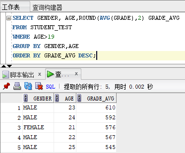

## 7. 子查询

为了方便接下来的实验，我们建立student、course、sc表并插入数据。建表和插入数据的sql语句见本文档末尾附2。

在SELECT语句内部使用SELECT语句，这个内部的SELECT语句就被称为子查询。

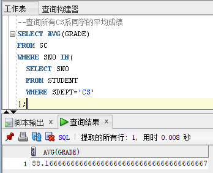

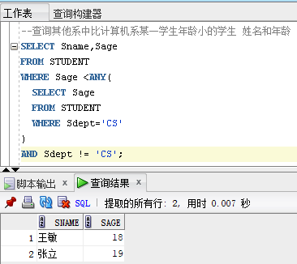

## 8. 简单连接查询

连接查询实际上是通过各个表之间共同列的关联性来查询数据的，是关系型数据库查询的最主要特征。简单连接是使用逗号将两个或多个进行连接，这也是最简单、最常用的多表查询形式。简单查询是指使用相等比较符指定条件的连接查询，这种连接查询主要用于检索主从表之间的相关数据。比如下面使用简单连接查看学生的姓名和考试成绩。

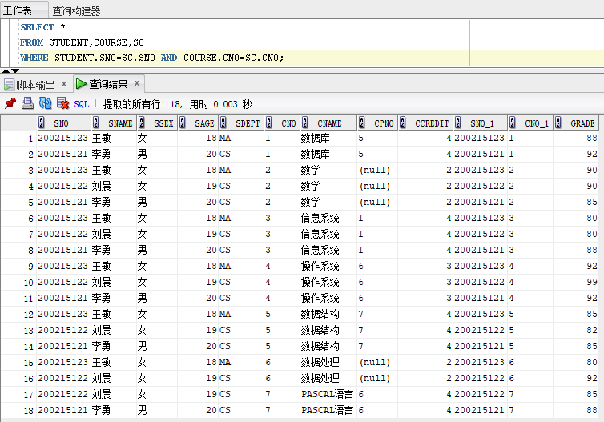

在连接查询中也可以给表起别名，指定要选择的列，另外再加一些筛选条件。

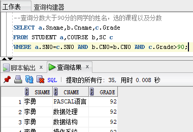

同时，连接查询也可以连接自身，在这里需要使用别名来区分前表和后表。

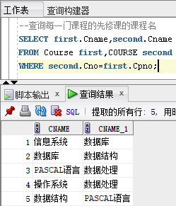

## 9. 课后作业

自行查阅相关资料，了解Oracle支持的字符串函数、数值函数、日期函数以及聚合函数，完成相关查询。要求截图中包含所写sql语句与查询结果。其中sql语句必须清晰可读，必要时可将其复制为文本粘贴在实验报告中。

使用student、course、sc表进行如下查询：

（1）查询所有学分等于4分的课程的平均成绩

（2）查询选修2号课程的学生姓名

（3）查询选修了课程名为信息系统的学生的学号和姓名

（4）查询其他系中比计算机系所有学生年龄小的学生 姓名和年龄

（5）找出每个学生超过他选修课程平均成绩的课程号

使用hr用户下的表进行如下查询：

（6）查询各部门的平均工资

（7）查询各部门的名称以及该部门的最高工资

（8）查询获得工资大于所有部门平均工资的员工信息

（9）查询所有在Finance部门工作的员工的姓名与工资

（10）查询月薪大于10000元的员工的姓名与工作地点

（11）查询工资比其经理工资高的员工姓名

（12）查询哪个地区平均工资最高*

（13）查询各部门工资最高的员工的姓名与工资**

## 附1：hr用户下表的字段及含义

    COUNTRIES (国家表)
    COUNTRY_ID 国家的ID
    COUNTRY_NAME 国家名
    REGION_ID 地区的ID
    
    DEPARTMENTS (部门表)
    DEPARTMENT_ID 部门ID
    DEPARTMENT_NAME 部门名称
    MANAGER_ID 部门经理ID
    LOCATION_ID 工作地点ID

    JOBS (职位表)
    JOB_ID 职位ID
    JOB_TITLE 职位标题
    MIN_SALARY 最低工资
    MAX_SALARY 最高工资
    
    EMPLOYEES (雇员表)
    EMPLOYEE_ID 雇员ID
    FIRST_NAME 姓
    LAST_NAME 名
    EMALL 邮箱
    PHONE_NUMBER 电话
    HIRE_DATE 雇佣时间
    JOB_ID 职位ID
    SALARY 工资
    COMMISSION_PCT 提成
    MANAGER_ID 部门经理ID
    DEPARTMENT_ID 部门ID
    
    REGIONS (地区表)
    REGION_ID 地区ID
    REGION_NAME 地区名
    
    LOCATIONS (工作地点表)
    LOCATION_ID 工作地点ID
    STREET_ADDRESS 地址
    POSTAL_CODE 邮编
    CITY 城市
    STATE_PROVINCE
    COUNTRY_ID 国家ID

## 附2：Student、Course和SC表的建表及插入数据语句

    CREATE TABLE STUDENT(
        SNO VARCHAR2(10),
        SNAME VARCHAR2(20),
        SSEX VARCHAR2(6),
        SAGE NUMBER(3),
        SDEPT VARCHAR2(10)
    );
    
    CREATE TABLE COURSE(
        CNO VARCHAR2(10),
        CNAME VARCHAR2(20),
        CPNO VARCHAR2(10),
        CCREDIT NUMBER(3)
    );
    
    CREATE TABLE SC(
        SNO VARCHAR2(10),
        CNO VARCHAR2(10),
        GRADE NUMBER(3)
    );
    
    INSERT INTO STUDENT VALUES('200215121' ,'李勇', '男', 20 ,'CS');
    INSERT INTO STUDENT VALUES('200215122', '刘晨', '女', 19 ,'CS'); 
    INSERT INTO STUDENT VALUES('200215123', '王敏', '女', 18 ,'MA'); 
    INSERT INTO STUDENT VALUES('200515125', '张立', '男', 19 ,'IS');
    
    INSERT INTO COURSE VALUES('1','数据库','5',4);
    INSERT INTO COURSE VALUES('2','数学',NULL,2);
    INSERT INTO COURSE VALUES('3','信息系统','1',4);
    INSERT INTO COURSE VALUES('4','操作系统','6',3);
    INSERT INTO COURSE VALUES('5','数据结构','7',4);
    INSERT INTO COURSE VALUES('6','数据处理',NULL,2);
    INSERT INTO COURSE VALUES('7','PASCAL语言','6',4);
    
    INSERT INTO SC VALUES('200215121', '1', 92);
    INSERT INTO SC VALUES('200215121', '2', 85);
    INSERT INTO SC VALUES('200215121', '3', 88);
    INSERT INTO SC VALUES('200215122', '2', 90);
    INSERT INTO SC VALUES('200215122', '3', 80);
    INSERT INTO SC VALUES('200215121', '4', 92);
    INSERT INTO SC VALUES('200215121', '5', 85);
    INSERT INTO SC VALUES('200215121', '7', 88);
    INSERT INTO SC VALUES('200215122', '4', 99);
    INSERT INTO SC VALUES('200215122', '5', 82);
    INSERT INTO SC VALUES('200215122', '6', 92);
    INSERT INTO SC VALUES('200215122', '7', 85);
    INSERT INTO SC VALUES('200215123', '1', 88);
    INSERT INTO SC VALUES('200215123', '2', 90);
    INSERT INTO SC VALUES('200215123', '3', 80);
    INSERT INTO SC VALUES('200215123', '4', 92);
    INSERT INTO SC VALUES('200215123', '5', 85);
    INSERT INTO SC VALUES('200215123', '6', 80);
    INSERT INTO SC VALUES('200215125', '1', 92);
    INSERT INTO SC VALUES('200215125', '2', 85);
    INSERT INTO SC VALUES('200215125', '3', 88);
    INSERT INTO SC VALUES('200215125', '7', 80);