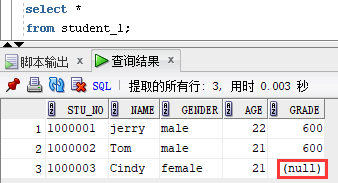

# 实验7  SQL查询与数据操纵语言

## 1. 实验6答案 仅供参考

（1）查询所有学分等于4分的课程的平均成绩

    SELECT CNO,ROUND(AVG(GRADE),2)
    FROM SC
    GROUP BY CNO
    HAVING CNO IN(
        SELECT CNO
        FROM COURSE
        WHERE CCREDIT=4
    );

（2）查询选修2号课程的学生姓名

    SELECT SNAME
    FROM STUDENT
    WHERE SNO IN(
        SELECT SNO
        FROM SC
        WHERE CNO='2'
    );

（3）查询选修了课程名为信息系统的学生的学号和姓名

    SELECT SNO, SNAME
    FROM STUDENT
    WHERE SNO IN (
        SELECT SNO
        FROM SC
        WHERE CNO IN (
            SELECT CNO
            FROM COURSE
            WHERE CNAME='信息系统'
        )
    );

（4）查询其他系中比计算机系所有学生年龄小的学生 姓名和年龄

    SELECT SNAME, SAGE
    FROM STUDENT
    WHERE SDEPT != 'CS' AND SAGE < ALL (
        SELECT SAGE
        FROM STUDENT
        WHERE SDEPT='CS'
    );

（5）找出每个学生超过他选修课程平均成绩的课程号

    SELECT SNO,CNO
    FROM SC X
    WHERE GRADE>(
        SELECT AVG(GRADE)
        FROM SC Y
        WHERE Y.SNO=X.SNO
    );

（6）查询各部门的平均工资

    SELECT B.DEPARTMENT_ID 部门,ROUND(AVG(SALARY),2) 平均工资
    FROM EMPLOYEES a,DEPARTMENTS b
    WHERE b.DEPARTMENT_ID = a.DEPARTMENT_ID
    GROUP BY b.DEPARTMENT_ID;

（7）查询各部门的名称以及该部门的最高工资

    SELECT DEPARTMENT_NAME 部门,MAX(SALARY) 最高工资
    FROM EMPLOYEES a,DEPARTMENTS b
    WHERE b.DEPARTMENT_ID=a.DEPARTMENT_ID
    GROUP BY DEPARTMENT_NAME, b.DEPARTMENT_ID;

（8）查询获得工资大于所有部门平均工资的员工信息

    SELECT *
    FROM EMPLOYEES
    WHERE SALARY>ALL(
        SELECT AVG(SALARY)
        FROM EMPLOYEES
        WHERE DEPARTMENT_ID IN(
            SELECT DEPARTMENT_ID
            FROM DEPARTMENTS
        )
        GROUP BY DEPARTMENT_ID
    );

（9）查询所有在Finance部门工作的员工的姓名与工资

    SELECT FIRST_NAME||' '||LAST_NAME,SALARY
    FROM EMPLOYEES A,DEPARTMENTS B
    WHERE B.DEPARTMENT_ID = A.DEPARTMENT_ID AND DEPARTMENT_NAME='Finance';

（10）查询月薪大于10000元的员工的姓名与工作地点

    SELECT FIRST_NAME||' '||LAST_NAME,CITY,STREET_ADDRESS
    FROM EMPLOYEES a,DEPARTMENTS b,LOCATIONS c
    WHERE b.DEPARTMENT_ID = a.DEPARTMENT_ID AND c.LOCATION_ID=b.LOCATION_ID AND SALARY>10000;

（11）查询工资比其经理工资高的员工姓名

    SELECT A.FIRST_NAME||' '||A.LAST_NAME NAME
    FROM EMPLOYEES A,EMPLOYEES B
    WHERE A.MANAGER_ID=B.EMPLOYEE_ID AND A.SALARY>B.SALARY;

（12）查询哪个地区平均工资最高*

    SELECT *
    FROM (
        SELECT E.REGION_NAME 地区,ROUND(AVG(A.SALARY),2) 平均工资
        FROM EMPLOYEES A,DEPARTMENTS B,LOCATIONS C,COUNTRIES D,REGIONS E
        WHERE A.DEPARTMENT_ID=B.DEPARTMENT_ID AND B.LOCATION_ID=C.LOCATION_ID AND C.COUNTRY_ID=D.COUNTRY_ID AND D.REGION_ID=E.REGION_ID
        GROUP BY E.REGION_NAME
        ORDER BY 平均工资 DESC
    )
    WHERE ROWNUM<=1;

（13）查询各部门工资最高的员工的姓名与工资**

    SELECT A.FIRST_NAME||' '||A.LAST_NAME NAME,A.SALARY
    FROM EMPLOYEES A
    WHERE A.SALARY=(
        SELECT MAX(B.SALARY)
        FROM EMPLOYEES B
        WHERE A.DEPARTMENT_ID = B.DEPARTMENT_ID
        GROUP BY B.DEPARTMENT_ID
    );

## 2. 使用join关键字进行连接查询

连接查询是数据库中应用非常广范的查询方式，它是通过各表共同列之间的关联性来查询数据的，它是关系型数据库查询最主要的特征。为了接下来的实验说明，现在在数据库中创建以下两张数据表，test_a和test_b：

Join操作基本分为3大类：外连接(细分为：左连接、右连接、全连接)、自然连接、内连接。Join操作的共性：第一步均为将所有参与操作的表进行了一个笛卡儿积，然后才依据各连接条件进行记录的筛选。首先先对上述两张表求笛卡尔积。

内连接与自然连接基本相同，不同之处在于自然连接只能是同名属性的等值连接，而内连接可以使用on子句来指定连接条件，连接条件中指出某两字段相等（可以不同名），例如下例。

假设两张表，A表共有m行，B表共有n行，现要将两表连接，两表连接的字段不存在空值，思考经过笛卡尔积、左连接、右连接、内连接查询后得到的结果会有多少行。

大部分的子查询都可以用连接查询进行改写，同时使用连接查询的速度往往会更快。例如下例。

同时join连接不仅可以只连接两张表，还可以将所有同学的选课信息全部查询出来。

同时用于连接的表也可以是一个子查询，例如查询有成绩大于90分的同学的姓名学号。

下一个例子是查询每门课的先修课的课名，如果没有先修课则为空。

## 3. 集合查询

集合操作符可以将两个或多个查询返回的结果组合起来，常用的集合操作符包括UNION、UNION ALL、INTERSECT和MINUS。

如果使用UNION ALL求并集则会保留重复的元素。

## 4. 插入数据

为了接下来的实验我们先创建一张数据表，该表表名为student_1，其中包含以下列：学号（stu_no）、学生姓名（name）、性别（gender）、年龄（age）、高考成绩（grade）。其中以学号为主键。

建表语句如下：

数据插入使用Insert into values语句，其语法规则如下：

    insert into table_name [(column1 [,coulmn2…])
    values(value1 [,value2…]

假设要向表中添加一条数据（1000001,jerry,male,22,600），注意字符串需要使用单引号包起来，使用insert语句如下：

代码运行成功后会出现上述字样。此时使用select * 语句查询全表数据，即可看到数据已经成功插入。

上述语句其实是insert语句的省略形式，默认对所有的列插入数据。当然，Oracle可以指定需要插入数据的列的。具体操作如下：

在表名后跟上一个括号指定要插入数据的列名，这样也可以插入数据。有时候并不需要向数据库中所有列都插入数据，可以通过指定列名的方法来向想要的列插入数据。例如有位同学的成绩未知，需要先添加数据后面再修改成绩，这时候insert语句就可以这样写：

查看数据后即可发现刚刚插入的Cindy同学的成绩为空，而其他同学的成绩有数值。

思考如果向刚刚的数据表中再插入一条stu_no为1000001的学生数据时会发生什么，尝试后将结果与思考编写进实验手册的心得部分。

## 5. 更新数据

Update语句可以对表中的数据进行修改。其具体的语法为：

    update table_name
    set column1=expression[, column2=expression]
    [where condition]

该数据表中记录的年龄可能每年需要更新一次，可以使用update语句对全表所有人的年龄进行修改，例如给所有人的年龄增加一岁：

运行完毕后每人的年龄都增加一岁。

在上面的实验中Cindy同学的成绩缺失，那么可以使用update语句针对Cindy同学这一行进行插入操作，代码如下：

 
这段语句的意思是在student_test表中将Name为Cindy的那行数据的Grade列的值修改为570。运行成功后查看表：

 
update语句中还可以进行条件的筛选，比如要给分数大于等于600分的同学再加10分，那么可以在where子语句中加入不等式的条件。

 
结果如下：
 

## 6. 删除数据
使用delete语句可以将数据库中的数据删除。Delete语句的语法如下：

    delete from table_name 
    [where condition]

delete操作会给数据库带来很大的风险，删除数据过程中一定要注意语句有无错误，一定要注意数据的安全。例如下面要删除stu_no为1000001的这行数据：

 
执行完毕后查看数据表发现数据已经少了一行。
 

## 7. 课后作业

（1）用查询语句完成下列查询：

1) 查询平均工资最高的部门信息*

2) 查询与Nancy同一部门的所有员工信息

3) 获取部门编号为100的所有员工信息

4) 获取工资比部门编号为100的所有员工工资高的员工姓名、工资和部门编号

5) 计算学生信息表中各个分数段的学生人数（以5分为间隔）

6) 查询工资第二高的员工的信息**

作业提示：需要返回查询结果的前三行可以使用下列语句
  select * from table where rownum<4;

（2）在hr用户中建立employees_test、departments_test和locations_test三张表，数据类型自拟，合理即可，注意表的完整性约束，并向每张表中插入三条数据。将建表语句与插入数据语句保存成SQL文件并复制到实验报告中（注意表中的约束，思考数据要如何插入）。自行练习update与delete语句，完成实验报告。
