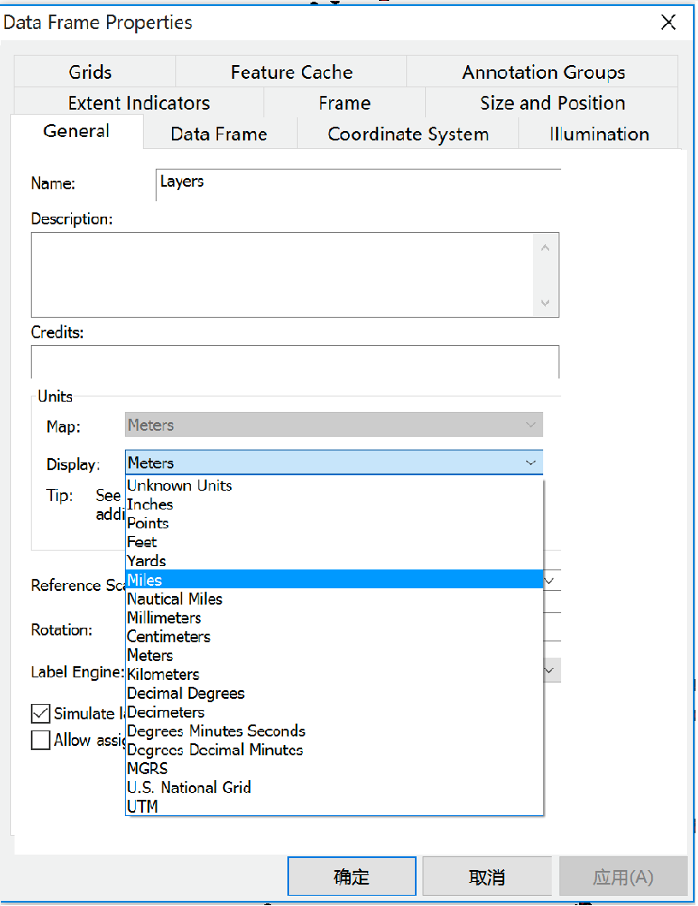

# 实验8-2  空间数据查询（2）

## 1. 由位置选择要素，并制作图表

所需数据： idcities.shp——爱达荷州654个地点shapefile文件；snowsite.shp——爱达荷州及其毗邻州的206个滑雪站的shapefile文件。

要求用“由位置选择要素”的方法，选择距爱达荷州的Sun Valley 40英里（Miles）范围之内的滑雪站（24个），并创建一个散点图（Y字段为ELEV；X字段为SWE_MAX；标题为Elev_SweMax），输出为Elev_SweMax.jpg。

首先在ArcGIS中加载上述两个数据，右键点击Layers，选择Properties，将整个Data Frame的现实单位修改为Miles

先选择出Sun Valley这个城市，点击菜单栏中的selection，选择Select by attributes，图层设置为idcities。在where中写入条件"CITY_NAME" = 'Sun Valley'。

点击确定，此时将Sun Valley选择出来了。

再次点击selection，选择select by location，将目标图层设置为snowsite，源图层设置为idcities，空间条件选择为within a distance，距离设为40miles。点击确定即可选择出距离Sun Valley 40 miles 的滑雪场了。

右键点击Snowsite图层，打开属性表，点击左上角的小按钮选择Create Graph创建统计图。

一个散点图（Y字段为ELEV；X字段为SWE_MAX）

点击下一步设置标题（标题为Elev_SweMax），在此处可以选择做图的数据是全部数据还是部分选择的数据。设置完毕后点击Finish结束。

在图像上点击右键选择Export可以将图表导出为jpg格式的图片。

## 2. 空间与属性组合的数据查询

所需数据：thermal.shp,包含899个热井（字段TYPE=w）和泉眼（字段TYPE=s）的shapefile文件，字段temp表示水温（˚C）；idroads.shp，爱达荷州主要道路的shapefile文件。

假设某公司要在爱达荷州确定温泉胜地的候选地点，选点的两个标准为：（1）温泉必须位于主要道路2 miles范围内；（2）温泉的温度必须高于60˚C。

（1）加载数据，显示单位Display为Miles。

（2）首先选择距离道路2miles范围内的点，使用Select by location，设置好相应表与条件，within a distance of 2 Miles. 

问题1，此时有多少温泉和热井被选中？

（3）然后再根据温度选择需要的点。使用Select by attributes，Select from current selection，"TYPE " = 's ' AND "temp" > 60

（4）使用地图提示功能。右击thermal\Properties\Display，勾选Show Map Tips，提示字段选择为TEMP

问题2，距道路2mi范围内且温度高于70˚C的热井和温泉有多少个？

## 3. 栅格数据查询

所需数据：slope_gd，坡度栅格文件；aspect_gd，坡向栅格文件。加载上述数据。若未启用空间分析模块，点击Customize中的Extensions，勾选启用Spatial Analyst。

在slope_gd图层点击右键查看属性表可知，该栅格数据集中1表示坡度格网内的坡度为10˚到20˚之间，Aspect_gd也类似。

在工具箱中找到Extract by Attributes工具，编写下列条件即可查询坡度在10˚到20˚之间的地块。

地图代数中的栅格计算器也可以完成类似的操作，尝试使用不同工具完成栅格数据的查询。

## 4. 课后作业

按步骤完成上述实验并撰写实验报告。

根据所学知识完成下列空间检索，将操作步骤及结果写进实验报告。

所需数据：cities.shp，爱达荷州194个城市的shapefile；counties.shp，爱达荷州各县的shapefile；idroads.shp，爱达荷州主要道路的shapefile文件。

cities.shp有一项属性称为CityChange，用于表示1990～2000年的人口变化率。county.shp含有1990年县城人口（pop1990）和2000年县城人口（pop2000）的属性。在该文件的属性中添加新字段CoChange，用于显示各县1990～2000年的人口变化率。通过以下表达式计算CoChange的字段值：（2000年县城人口-1990年县城人口）×100/ 1990年县城人口。

问题1: 位于博伊西（BOISE）50miles范围内的城市的平均人口变化率是多少？

问题2: 与州际公路相交并且CoChange≥30的县有多少个？

问题3: 符合CityChange≥50的城市中，有多少个是的CoChange≥30的县域之内？