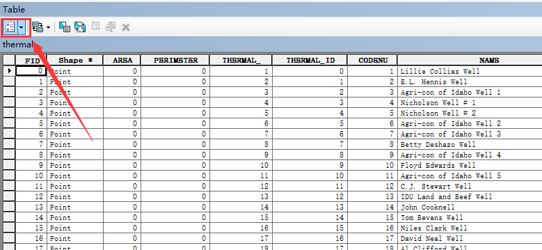
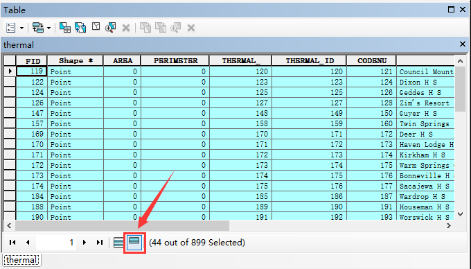
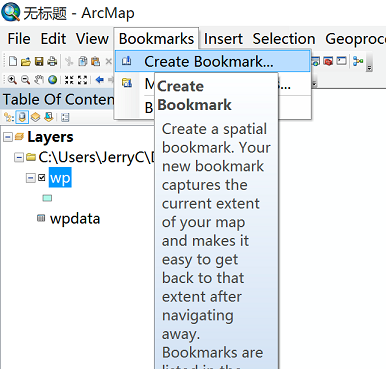
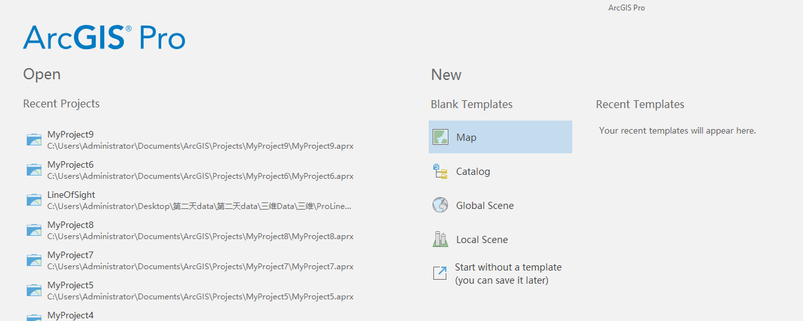
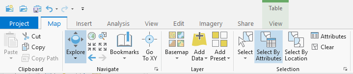

# 实验8  空间数据查询

## 1. 实验7答案 仅供参考

（1）查询平均工资最高的部门信息*

    select a.*,平均工资
    from departments a join(
        select department_id,round(avg(salary),2) 平均工资
        from employees
        group by department_id
        order by 平均工资 desc
    )b on a.department_id=b.department_id
    where rownum<=1;

（2）查询与Nancy同一部门的所有员工信息

    select *
    from employees
    where department_id in(
        select department_id
        from employees
        where first_name='Nancy'
    );

（3）获取部门编号为100的所有员工信息

    select * 
    from employees
    natural join departments
    natural join locations
    natural join countries
    natural join regions
    where department_id=100;

（4）获取工资比部门编号为100的所有员工工资高的员工姓名、工资和部门编号

    select first_name||' '||last_name Name,salary,department_id
    from employees a
    where a.salary>all(
        select b.salary
        from employees b
        where b.department_id=100
    );

（5）计算学生信息表中各个分数段的学生人数（以5分为间隔）

    select '60-65分' 分数,count(*) 人数
    from sc where grade>=60 and grade<65
    union
    select '65-70分' 分数,count(*) 人数
    from sc where grade>=65 and grade<70
    union
    select '70-75分' 分数,count(*) 人数
    from sc where grade>=70 and grade<75
    union
    select '75-80分' 分数,count(*) 人数
    from sc where grade>=75 and grade<80
    union
    select '80-85分' 分数,count(*) 人数
    from sc where grade>=80 and grade<85
    union
    select '85-90分' 分数,count(*) 人数
    from sc where grade>=85 and grade<90
    union
    select '90-95分' 分数,count(*) 人数
    from sc where grade>=90 and grade<95
    union
    select '95-100分' 分数,count(*) 人数
    from sc where grade>=95 and grade<=100;

（6）查询工资第二高的员工的信息

    select * 
    from employees a join (
        select employee_id, dense_rank() over (order by salary desc) rank
        from employees)b
    on a.employee_id=b.employee_id
    where rank=2;

## 2. 使用ArcGIS Desktop按属性查询

所需数据：thermal.shp,包含899个热井（字段TYPE=w）和泉眼（字段TYPE=s）的shapefile文件，字段temp表示水温（˚C）

在ArcGIS中加载数据，右击图层打开属性表，选择左上角按钮选择Select By Attributes按属性查询：

查看温度高于60 ˚C的泉眼有几个，分布在哪些位置。在where中写入条件"TEMP" >60 AND "TYPE" = 's'

点击应用，查看已选中的结果。

## 3. 由合并的属性数据表查询数据

所需数据：wp.shp，林场的shapefile文件；wpdata.dbf，含有林场数据的bBASE文件。在ArcGIS中打开上述数据。在wp图层上点击右键，选择relate and join中的join，以ID为中间字段，关联图层wp和表wpdata。

连接完成后可以执行下列查询操作。

Select by attributes，，选中记录个数T1为多少？

Select from current selection，Select by attributes，ELEV小于30，此时选中记录个数T2为多少？

点击Clear Selected Feature清除所选要素，再次选择Select by attributes，ORIGIN在0至1900之间AND ELEV小于30，此时选中记录个数T3为多少？

点击Bookmarks可以创建书签记录下本次选择的数据，便于下次查看所选记录。

## 4. 使用 ArcGIS Pro 按属性查询

从 ArcGIS 平台架构上来看，ArcGIS Pro 属于应用层，是为新一代 Web GIS 平台，面向GIS 专业人士（例如 GIS 工程师、GIS 科研人员、地理设计人员、地理数据分析师等），全新打造的一款高效、具有强大生产力的桌面应用程序。ArcGIS Pro 除了良好地继承了传统桌面软件（ArcMap）的强大的数据管理、制图、空间分析等能力，还具有其独有的特色功能，例如二三维融合、大数据、矢量切片制作及发布、任务工作流、时空立方体等。

打开 ArcGIS Pro，可能会弹出一个安全警报窗口，选择 是，等待

新建一个项目，选择保存路径和文件名：

右击 Map，选择 Add Data 添加数据，添加 thermal.shp，数据说明见步骤 1。

在工具栏中选择 Map，Select By Attributes

Input Rows 输入行选择 thermal，点击 Add Clause 添加子句，选择水温大于 60 度的泉眼

## 5. 课后作业

使用ArcGIS Desktop或ArcGIS Pro完成上述实验，并撰写实验报告。

使用ArcGIS Desktop或ArcGIS Pro完成以下查询，将操作步骤及结果写进实验报告：

（1）	在thermal.shp中找出名称以D开头的泉眼

（2）	在（1）的查询结果中，温度大于等于60摄氏度的泉眼

（3）	在thermal.shp中找出名称中含有Land且温度在60至70之间的热井和泉眼

（4）	在idcities.shp，counties.shp中找出coun_name为MINIDOKA包含的城市

（5）	在（4）的当前查询中，找出城市名含有A且population大于100的城市
