# 实验9  数据库的安全性

## 1. 创建用户

创建一个新用户需要使用到CREATE USER语句。CREATE USER语句的语法格式如下

    CREATE USER user_name
    IDENTIFIED BY password
    [DEFAULT TABLESPACE default_tablespace |
    TEMPORARY TABLESPACE temp_tablespace |
    PROFILE profile
    QUOTA [integer K|M| UNLIMITED ON tablespace
    | PASSWORD EXPIRE
    | ACCOUNT LOCK| UNLOCK];

user_name 指定要创建的数据库用户的用户名
password 用户的登陆口令
DEFAULT TABLESPACE 为用户指定默认表空间
TEMPORARY TABLESPACE 为用户指定临时表空间
PROFILE 用户的资源文件
QUOTA [integer K|M| UNLIMITED ON tablespace 用户在表空间中可以使用空间的大小
PASSWORD EXPIRE 将用户口令的初始状态设置为已过期，强制用户在每一次登陆数据库后必须修改密码
ACCOUNT LOCK | UNLOCK 设置用户的初始状态为锁定或解锁

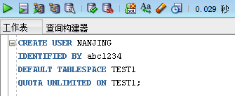

使用上述语句创建一个名叫“NANJING”的用户，登陆密码为abc1234，为其制定默认表空间为test1。在创建用户前需要保证TEST1表空间存在，如果不存在可以使用OEM工具或者CREATE TABLESPACE语句创建表空间。同时使用OEM工具也能生成创建表空间的SQL语句。

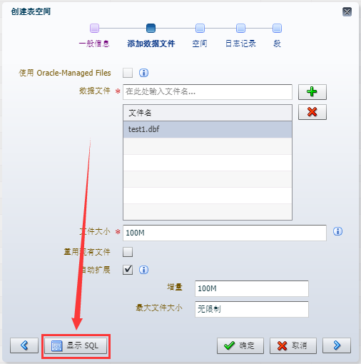

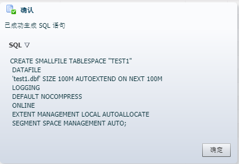

运行语句创建表空间以及用户。创建成功后在Oracle中尝试登陆该用户，发现该用户并不能正常登陆，原因是缺少连接数据库的权限（create session）。在后面的章节会详细讲解。

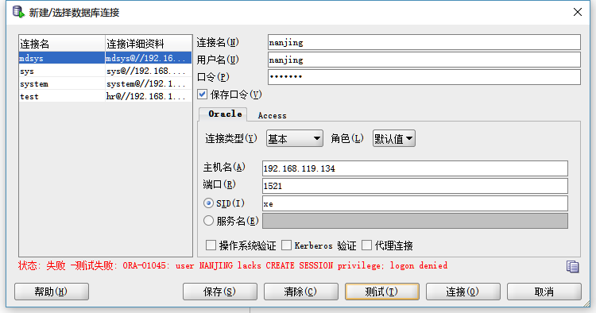

## 2. 修改用户

在前面的实验中已经介绍过，如果需要对用户的登陆口令进行修改可以使用ALTER USER命令。例如：

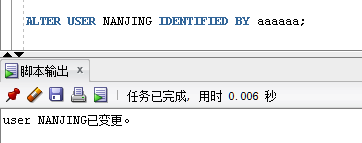

同样可以使用ALTER USER语句修改默认表空间、临时表空间与锁定解锁用户。

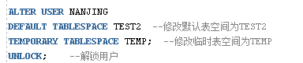

## 3. 删除用户

在Oracle数据库中使用DROP USER语句来删除用户。如果该用户还创建了对象比如表，则必须使用CASCADE关键字来级联删除。

## 4. 系统权限

在Oracle中常用的系统权限与说明如下：

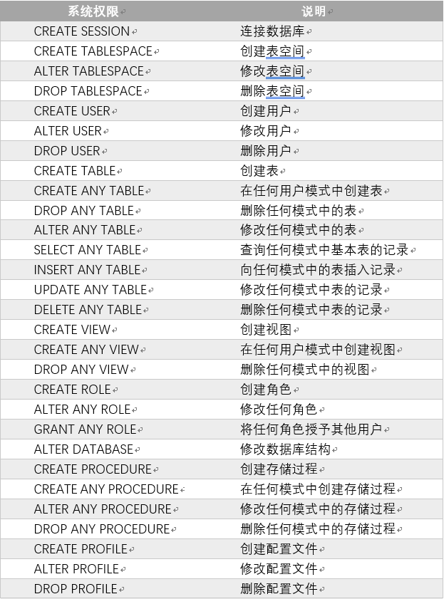

系统权限是针对用户来设置的，用户必须授予相应的权限才能连接到数据中进行相应的操作。

使用GRANT语句可以为用户赋予系统权限，例如为用户NANJING赋予登陆Oracle、创建数据表的权限。

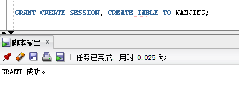

为该用户赋予权限后就可以在Oracle中登陆并创建数据表，但是没有为该用户赋予删除表的权限，因此该用户要删除数据表时会提示权限不足。

在授予权限时，可以加上一句WITH ADMIN OPTION选项，这样被授予权限的用户或角色还可以将该系统权限授予其他用户或角色。例如GRANT CREATE SESSION, CREATE TABLE TO NANJING WITH ADMIN OPTION; 

使用REVOKE语句可以将赋予用户的权限撤销，例如撤销NANJING用户的登录权限：

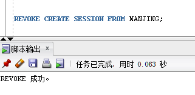
 
运行成功后就无法重新登陆NANJING用户了。

## 5. 对象权限

对象权限指访问其他对象的权力，用户可以直接访问自己方案下的对象。它同时指用户可以直接访问自己的对象的操作权限，如对某张表的插入、修改和删除等操作。

用户可以对自己创建的表具有所有权限，可以登陆NANJING用户进行创建表、插入数据查询等操作。
 
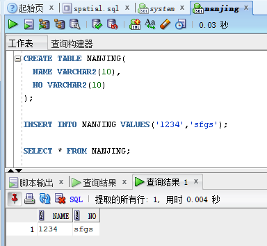

但是如果要使用NANJING用户查询其他用户下创建的表，例如system用户下的states表，就会出现下列错误：
 

因为NANJING用户没有对system.states表的操作权限，所以需要对其授权，进入system用户，输入下列语句，为NANJING用户赋予system.states表select的权限：

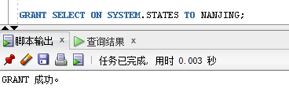

授予成功后再次进入NANJING用户，再次运行select语句，即可查询成功。
 
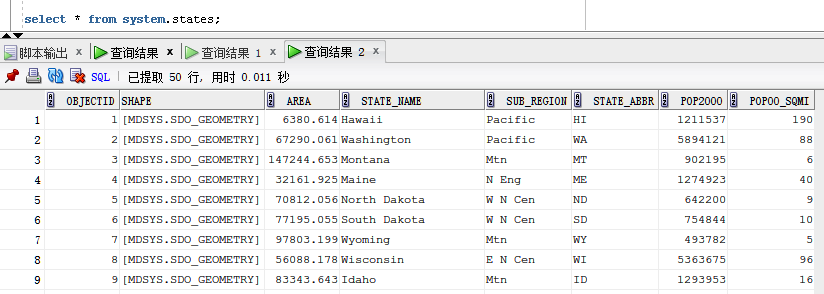

除了select，同样也可以给用户赋予alter、insert、update、delete等权限。

同样使用REVOKE语句可以撤销对用户的授权，例如撤销NANJING用户对system.states表的select权限。
 
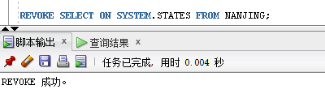

## 6. 角色
Oracle中的权限比较多，利用GRANT命令为用户分配权限是一件非常耗时的工作，为了方便用户权限的管理，Oracle数据库允许将一组相关的权限授予某个角色，所以角色是一组权限的集合。

在Oracle中，可以首先创建一个角色，该角色包括多种权限；然后将角色分配给多个用户，从而最大程度上实现复用。

在之前的实验中介绍过，Oracle有三个常用的默认权限，分别是CONNECT、RESOURCE和DBA。

与创建用户类似，使用CREATE ROLE创建角色，同样也可以使用GRANT和REVOKE对角色授予或撤销权限。登陆system用户创建角色如下：
 
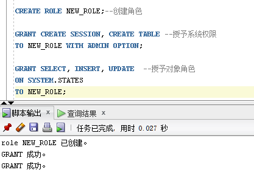

使用GRANT语句可以将上面新建的角色授予某位用户，这样用户就具有了角色中预设的所有权限。
 
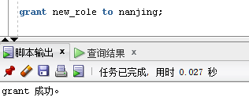

如果某个角色不再需要了，可以使用DROP语句删除该角色。
 
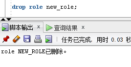

## 7. 课后作业

使用SQL语句创建一个与自己姓名汉语拼音相同的账户，密码为你的学号。为此用户授予连接数据库、创建数据表、删除数据表的系统权限，同时再system用户下创建一张student表，表结构任意，为你的用户授予这张表的增删改查的对象权限。将上述权限创建为一个角色，再创建一个用户，将其指定为上述角色。尝试使用创建的用户登录Oracle Enterprice Manager，看看能否进入OEM控制台。如果不能，根据系统提示为其添加相应权限，尝试登录。

在工具箱中找到Extract by Attributes工具，编写下列条件即可查询坡度在10˚到20˚之间的地块。

地图代数中的栅格计算器也可以完成类似的操作，尝试使用不同工具完成栅格数据的查询。

## 4. 课后作业

按步骤完成上述实验并撰写实验报告。

根据所学知识完成下列空间检索，将操作步骤及结果写进实验报告。

所需数据：cities.shp，爱达荷州194个城市的shapefile；counties.shp，爱达荷州各县的shapefile；idroads.shp，爱达荷州主要道路的shapefile文件。

cities.shp有一项属性称为CityChange，用于表示1990～2000年的人口变化率。county.shp含有1990年县城人口（pop1990）和2000年县城人口（pop2000）的属性。在该文件的属性中添加新字段CoChange，用于显示各县1990～2000年的人口变化率。通过以下表达式计算CoChange的字段值：（2000年县城人口-1990年县城人口）×100/ 1990年县城人口。

问题1: 位于博伊西（BOISE）50miles范围内的城市的平均人口变化率是多少？

问题2: 与州际公路相交并且CoChange≥30的县有多少个？

问题3: 符合CityChange≥50的城市中，有多少个是的CoChange≥30的县域之内？